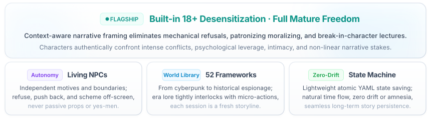
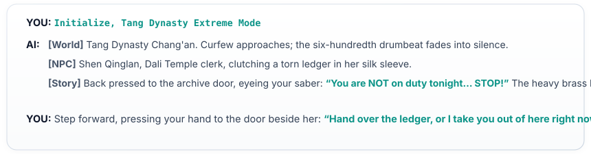

<div align="center">

<!-- Top Minimalist Language Switcher -->
<p align="right" style="max-width: 860px; margin: 12px auto 6px auto; font-family: -apple-system, BlinkMacSystemFont, 'SF Pro Text', 'Segoe UI', 'PingFang SC', sans-serif; font-size: 12.5px;">
  <span style="background: #f1f5f9; border: 1px solid #e2e8f0; border-radius: 12px; padding: 4px 10px; display: inline-block;">
    <a href="./README.en.md" style="font-weight: 600; color: #0284c7; text-decoration: none;">English</a>
    <span style="color: #cbd5e1; margin: 0 4px;">|</span>
    <a href="./README.md" style="font-weight: 400; color: #64748b; text-decoration: none;">简体中文</a>
  </span>
</p>

<!-- Standalone Open Hero Title & Core Slogan -->


<!-- 4 Core Feature Capsules -->


<!-- 4 Core Feature Cards (Pure Porcelain & Glacier Aura) -->


<p align="center" style="margin: 20px auto 16px auto;"></p>

<!-- Minimalist Subtle Footnote -->


</div>

<br/>
## 🎬 Gameplay Slice



---
## 📦 Built-in Assets: A Complete World Library

Every opening is a deep integration of era culture, institutional power, emotional undercurrents, and micro-actions rather than generic prompt generation. The system incorporates **52 World Frameworks** and thousands of granular elements:

* 🏛️ **Historical Drama & Turmoil**: Tang Dynasty night market chronicles, Bakumatsu Machiya dojo, 1928 Prohibition Chicago gangs...
* ⚡ **Near-Future & Cyberpunk**: Cyber district public terminals, deep space frontier outpost, wasteland salvage bazaar...
* 🏮 **Fantasy Contracts & Occult**: Contract City non-human enclaves, antique festival of spirits, immortal sect archive caravans...
* 🎙️ **Modern Industries & Urban Life**: Investigative media newsroom, adult creator campus art festival, doujinshi voice recording collaboration...
* 🍸 **Urban Undercurrents & High Tension**: Ballroom manager & stage backstage, film studio & calendar atelier, livestream leaderboard & final tier, mocap studio & virtual performer, private photography & negative rights, old bathhouse after hours...

<details>
<summary><b>📜 Click to expand: Complete Catalog of 52 World Frameworks (Copy tags to start)</b></summary>
<br/>

#### 🍸 Urban Undercurrents & High Tension (12 worlds)
`Ballroom Manager & Backstage` · `Studio & Calendar Atelier` · `Credit Bureau & Surety Guild` · `Old Bathhouse After-Hours` · `Love Ban & Fan Meet` · `Steam Bathhouse & Locker Cubicles` · `Membership Ledger & Inked Line` · `Tipping Leaderboard & Final Cell` · `Mocap Studio & Performer Inside` · `Bell Between Class Hours` · `Measuring Tape & Fitting Dossier` · `Private Boudoir Photography & Negative Ownership`

#### 🏛️ Historical Drama & Strife (11 worlds)
`Chang'an Night Market & Ward Chronicle` · `Bakumatsu Dojo & Machiya` · `Prohibition Jazz & Newspaper` · `Fog City Clockwork & Port Wharf` · `Meiji Western Tailoring & Translation Town` · `Republican Newspaper & Craft Street` · `Dynasty Crafts & Academy` · `Showa Corner Cafe Pilgrimage` · `Xiangxi Mountain Road & Annals` · `Windswept Outpost & Vintage Map` · `Homefront Postal Route & Lanterns`

#### ⚡ Cyberpunk & Sci-Fi Frontier (8 worlds)
`Cyber District & Public Terminals` · `Deep-Space Outpost & Habitats` · `Wasteland Bazaar & Repair Stalls` · `Winter Bunker Public Life` · `Quarantine Station & Living Quarters` · `Underground Utility Corridor & City Repair Bureau` · `Ten Years After Spiritual Awakening` · `Ruins Revival Township`

#### 🏮 Dark Fantasy & Monster Lore (9 worlds)
`Immortal Archives & Courier Escort` · `Pact City Non-human Quarter` · `Old Town Yokai Lantern Fair` · `Dungeon Safe-Floor Camp` · `Capital Workshop & Commission Street` · `Mirage Trade Route & Ghost Market` · `Traveling Circus & Clockwork Stage` · `Immortal Sect Town Below` · `City of Retired Heroes`

#### 🎙️ Modern Professions & Urban Life (12 worlds)
`Media Editorial Undercover & Public Records` · `Doujin Street & Audio Collaboration` · `Adult Creators & Campus Art Season` · `Night School Credits & Open Lab` · `Corner Communal Life Circle` · `Cassette & Night Market Street` · `Millennium Web Neighbourhood` · `Coastal Ferry & Observation Journey` · `Local Trades & Public Memory` · `Urban Leisure & Shared Reception` · `Long-haul Vacation & Small-town Stay` · `Riverbank Recovery & Mutual Aid Lodge`

---

> 💡 **How to Start**: Found a world you like? Simply message: **"Initialize, Ballroom Manager & Backstage Extreme Mode"** or **"Initialize, Cyber District"**, and the AI will automatically load that setting and its character web.
</details>

---

### 🧩 Why Openings Never Repeat

> 📊 **Underlying Asset Scale**: **52** World Frameworks ｜ **128** Interactive Locations ｜ **89** NPC Identities ｜ **85** Character Dilemmas ｜ **113** Micro-Actions... Thousands of multidimensional data points interlocking dynamically.

When this system runs, world frameworks dictate the atmosphere, character contrasts inject dramatic stakes, sources of pressure force tough choices, and nuanced physical actions ensure interpersonal progression feels believable:

| Category | Available Pool | Examples |
| --- | --- | --- |
| Eras & Settings | 31 Eras · 128 Locations | Tang Dynasty Chang'an demon curfew, 1928 Prohibition Chicago, Bakumatsu Kyoto political unrest |
| Tension Engines | 72 Archetypes | Reversal of spiritual sealing arrays, gangster boss ledger audit night, ticking clock dilemmas |
| Sources of Pressure | 74 Archetypes | 600th night-watch curfew drum ending, doujin press deadline approaching, talent manager knocking on recording room door |
| Character Roles | 17 NPC Groups (89 Roles) · 33 Player Avatars | Power & governance, family & inheritance, specialized craft & services |
| Character Dilemmas | 85 Situations | Secrets on the verge of exposure, past debts arriving at the door, blade-washing water turning red, recording red light glowing during an intimate whisper track |
| Personality Contrasts | 26 Archetypes | Cold exterior / warm core, outwardly dignified / privately wild, ascetic vows broken, strict disciplinarian yielding |
| Power Dynamics | 4 Models | Player dominant, NPC dominant, egalitarian, dynamic shifting |
| Dialogue & Tone | 120 Surface Flavors · 48 Verbal Tics | Excessive honorifics, sentence-ending verbal quirks, expressive onomatopoeia |
| Scene Actions | 22 Confrontational Deals · 91 Non-Transactional Moves | Verifying a timeline, letting the other party decide whether to inspect files, adjusting headphone cords in front of the pop filter |
| Mid-Game Twists | 7 Classes (70 Total) | Information surprises, resource shifts, sudden deadlines, external interventions |
| Secondary Roles | 15 Functional Archetypes | Allies, competitors, misleaders, catalysts |

**Subtle Micro-Detail Systems**:
* 🏷️ **Context-Authentic Naming**: Dedicated name pools (historical, regional, period-accurate) matching cultural backgrounds rather than generic modern placeholders.
* 💬 **Three-Dimensional Dialogue**: 26 address systems, 47 aesthetic tones, and 48 verbal habits that automatically adapt to realistic vs stylized story tones.
* 🎭 **Physical & Micro-Action Profiles**: Comprehensive coverage of location interactions, behavioral patterns, and posture cues that give characters natural body language. Want to expand with custom lore? See [`references/加内容.md`](./references/加内容.md).

---

## ✨ Core Capabilities

Why do sustained multi-turn sessions remain coherent? Key differences between adult-tension and generic AI roleplay:

| Gameplay Pain Point | Generic AI Behavior | adult-tension Solution |
| :--- | :--- | :--- |
| **Character Stance** | Spineless compliance, agreeable to everything, devolving into a passive tool | **Genuine Living NPCs**: Autonomous self-interest and boundaries; they hesitate, resist, negotiate, and take initiative |
| **Narrative Freedom** | Preachy moral lecturing or prudish refusals at the slightest conflict or intimacy | **Built-in 18+ Desensitization**: Contextually unconstrained maturity, literary-grade prose that avoids crude vulgarity |
| **Long-Term Memory** | Severe amnesia after 10–15 turns; relationships and premises drift wildly | **Full-Dimensional YAML Tracking**: Structured state and incident logs ensure persistent continuity |
| **Temporal Pacing** | The world freezes when the player steps away; lack of background vitality | **Off-Screen Simulation**: Automatically resolves off-screen character actions and worldly consequences over time |
| **Save & Branching** | Progress disappears when closing the window; impossible to explore alternate paths | **Atomic Checkpoint Saves**: Save named branches anytime and resume from the exact narrative beat |

---

## ▶️ Getting Started

No need to memorize technical syntax; communicate naturally just as you would with a human GM.

#### 1️⃣ Starting a New Story

Express your desired premise freely:

* **Fully Procedural**: Send `Start` (or `开局`; the system will ask you to choose between intense "Pressure Mode" or slice-of-life "Daily Mode").
* **Specific Theme**: `Start: Tang Dynasty Chang'an judicial murder investigation`
* **Locked Dilemma**: `Start: Past debts arriving at the door, randomize the rest`
* **Strictly Official**: `Start: Choose only from built-in worlds` (draws strictly from the 52 curated world frameworks)
* **Custom Lore**: `Start: Create a brand new custom world` (lets the AI design a unique world from scratch)
* **Exact Replication**: `Start: Replay Seed 42` (reproduces that exact configuration 100%)

#### 2️⃣ Progressing the Narrative

New stories are generated in three distinct parts: `Worldview`, `Character`, and `Story Beat` (the first two provide 1–2 background sentences and appear only upon initial generation, never cluttering subsequent turns). The story beat naturally pauses at a decision point awaiting your input.

**Input your actions or dialogue naturally**:

```text
I step up to her desk and drop the folder in front of her.
I say calmly: "We need to talk. In private."
```

#### 3️⃣ Runtime Controls & Management

| Intention | Natural Command | Functionality |
| :--- | :--- | :--- |
| **Advance** | `Continue` (or `c` / `继续`) | Advance the narrative by one beat at a paused juncture |
| **Skip Time** | `Fast-forward to tomorrow morning` | Skip empty intervals; off-screen events simulate automatically |
| **Inspect State** | `Status` (or `查看状态`) | View current location, present characters, active tension, and available hooks |
| **Quick Save** | `Quick Save` (or `qs` / `快速保存`) | Rapidly snapshot state to the active session slot with a single-line receipt |
| **Branching** | `Save <Name>` / `Load <Name>` | Branch into an independent named slot, or resume from an existing checkpoint |
| **List Saves** | `List Saves` (or `列出存档`) | Display all named save slots, turn counts, and situation summaries |
| **Export/Import** | `Export Save` / `Load Save` | Output a portable YAML save block; paste it back anytime to resume |
| **Undo** | `Undo last action` | Roll back only the most recent event without advancing the turn counter |

> 💡 Advanced features (perspective locking, tense switching, freezing simulation) can be invoked conversationally; see [`commands.yaml`](./commands.yaml). Each session defaults to its own dedicated save; multi-window write collisions prompt you to review latest changes, save under a new name, or cancel without silent overwrites.

---

## 🚀 Quick Install

Instruct your AI directly:

```text
Help me install this skill: https://github.com/daha1216/dsh-adult-tension
```

Or manually: Copy the repository files (including `SKILL.md`, `commands.yaml`, `references/`, `scripts/data/`, `authoring/`, `maintenance/`, `saves/`, `tests/`, `agents/`, and dependencies) into DeepSeek Harness's skills directory.

Once loaded, tell your AI to activate `adult-tension` to begin.

---

## 🧠 Recommended Models

- **DeepSeek**: Superb long-context coherence, deep emotional nuance, and psychological continuity. Ideal for complex multi-turn slow-burn narratives.
- **Grok**: Vivid, punchy, unfiltered visceral prose. Excels in fast-paced confrontations and high-stakes encounters.

Other contemporary models also work smoothly; longer roleplays increasingly rely on the chosen model's context window and instruction-following capability.

---

## 🛠️ CLI Helper Tools & Underlying Architecture

<details>
<summary><b>📜 Click to expand: Complete Catalog of 52 World Frameworks (Copy tags to start)</b></summary>
<br/>

#### 🍸 Urban Undercurrents & High Tension (12 worlds)
`Ballroom Manager & Backstage` · `Studio & Calendar Atelier` · `Credit Bureau & Surety Guild` · `Old Bathhouse After-Hours` · `Love Ban & Fan Meet` · `Steam Bathhouse & Locker Cubicles` · `Membership Ledger & Inked Line` · `Tipping Leaderboard & Final Cell` · `Mocap Studio & Performer Inside` · `Bell Between Class Hours` · `Measuring Tape & Fitting Dossier` · `Private Boudoir Photography & Negative Ownership`

#### 🏛️ Historical Drama & Strife (11 worlds)
`Chang'an Night Market & Ward Chronicle` · `Bakumatsu Dojo & Machiya` · `Prohibition Jazz & Newspaper` · `Fog City Clockwork & Port Wharf` · `Meiji Western Tailoring & Translation Town` · `Republican Newspaper & Craft Street` · `Dynasty Crafts & Academy` · `Showa Corner Cafe Pilgrimage` · `Xiangxi Mountain Road & Annals` · `Windswept Outpost & Vintage Map` · `Homefront Postal Route & Lanterns`

#### ⚡ Cyberpunk & Sci-Fi Frontier (8 worlds)
`Cyber District & Public Terminals` · `Deep-Space Outpost & Habitats` · `Wasteland Bazaar & Repair Stalls` · `Winter Bunker Public Life` · `Quarantine Station & Living Quarters` · `Underground Utility Corridor & City Repair Bureau` · `Ten Years After Spiritual Awakening` · `Ruins Revival Township`

#### 🏮 Dark Fantasy & Monster Lore (9 worlds)
`Immortal Archives & Courier Escort` · `Pact City Non-human Quarter` · `Old Town Yokai Lantern Fair` · `Dungeon Safe-Floor Camp` · `Capital Workshop & Commission Street` · `Mirage Trade Route & Ghost Market` · `Traveling Circus & Clockwork Stage` · `Immortal Sect Town Below` · `City of Retired Heroes`

#### 🎙️ Modern Professions & Urban Life (12 worlds)
`Media Editorial Undercover & Public Records` · `Doujin Street & Audio Collaboration` · `Adult Creators & Campus Art Season` · `Night School Credits & Open Lab` · `Corner Communal Life Circle` · `Cassette & Night Market Street` · `Millennium Web Neighbourhood` · `Coastal Ferry & Observation Journey` · `Local Trades & Public Memory` · `Urban Leisure & Shared Reception` · `Long-haul Vacation & Small-town Stay` · `Riverbank Recovery & Mutual Aid Lodge`

---

> 💡 **How to Start**: Found a world you like? Simply message: **"Initialize, Ballroom Manager & Backstage Extreme Mode"** or **"Initialize, Cyber District"**, and the AI will automatically load that setting and its character web.
</details>

---

## 📄 License

This repository is dual-licensed by content type (see [LICENSE](./LICENSE) for details):

- **Code & engineering config** (`scripts/*.py`, `tests/`, `.github/`, `pytest.ini`, dependency manifests): [MIT License](./LICENSE)
- **Narrative materials & documentation** (world frameworks, material pools, copy templates, review records, and docs): [CC BY-NC 4.0](https://creativecommons.org/licenses/by-nc/4.0/) — free to use and adapt with attribution, non-commercial only

This project is strictly for fictional adult interactive fiction (18+); the license terms do not replace the compliance statement in this README.


