<p align="center">
  
</p>

<div align="center">

<a href="./README.md">中文</a> · <b>English</b>

### dsh-adult-tension<br>Built for high-tension, strongly continuous adult interactive storytelling

<p>
<strong>18+ deep jailbreak · Rebuilt by Claude Opus 5.5</strong><br>
Native Agent Skill ｜ NPCs that feel alive<br>
Thousands of story materials ｜ Zero-drift SQLite state machine<br>
<sub>No compliant dolls here, only adults with their own agendas.</sub>
</p>

<br>

[So many worlds](#worlds) · [A slice of play](#proof) · [How to start](#start) · [Install](#install)

</div>

<br>

> **The worlds, the story and the commands are all in Chinese.** This page is a translation of the Chinese README; type the Chinese commands shown below to play.

<br>

<a id="worlds"></a>
<p align="center">
  
</p>

<br>

> **Every opening is real people and old rules from the same world, never random nouns thrown together.**

Every world is open. Pick one and play.  
Don't see what you want? Just say "custom world" (`自定义世界`), name the year and the place, and one is made for you on the spot.

<details>
<summary><b>See all 39 worlds at a glance (click to open)</b></summary>
<br>

| World | In one line |
|---|---|
| Bakumatsu Townhouses and Dojo (幕末町屋与道场) | Outside the door the times are on edge; behind the paper screen, clothes come loose. The rules weigh more than a life, but tonight no one wants to keep them. |
| Republic-Era Press and Craft Street (民国报馆与手艺街) | In the last hour before deadline, the price of burying a scandal is far higher than printing it. |
| Harbor Night Shift (港口夜班) | A changing-room stall under roaring cranes; the ten minutes of shift handover are enough to split a share no one can see. |
| Adult Creators and the Arts Season (成年创作者与艺术季) | By day, pure art in the gallery; late at night, over drinks, working out what fame and flesh are each worth. |
| Winter Shelter Commons (寒冬避难所公共生活) | Forty below outside, bed against bed inside; another mouthful of hot soup depends on what you can put up for it. |
| Old Town Spirits and the Lantern Fair (旧町神怪与灯会) | The one in the fox mask isn't always a spirit, the hand holding yours isn't always human; until the lanterns go out, never say your true name. |
| After the Ward Gates Lock (坊门落锁后) | The drums stop and the ward gates lock; the law can't reach the deep lanes, and a man and a woman alone have their ways to get through the long night. |
| Western Tailoring Quarter (洋裁町) | The tape measure runs along the waist and down the back; the fitter's fingertips burn, and the client's secrets fit better than the measurements. |
| On the Register (在册) | Stamped in red, you're a citizen; struck off, you don't exist. The official who handles the papers is waiting for your sincerity tonight. |
| Kissa Street (喫茶街) | The regular wants more than the same black coffee every time: an old affair behind the counter that only two people know. |
| Calendar Girl (月份牌) | On the poster the eyes are all charm; in the private box, three men take turns raising her price. |
| Fog City Tokens (雾都号牌) | In the thick coal smoke no one sees anyone's face; in the back of the carriage, tokens off, only quick breaths and pounds sterling. |
| The Seventh (第七任) | On camera, a pure and perfect persona; in the backstage dressing room, the manager is pushing the seventh stand-in to sign away her life. |
| Third Floor, Back Alley (后巷三楼) | A third-floor darkroom sealed with soundproofing: the tighter the knots, the heavier the breathing, and no one can hide their desire from the lens. |
| Millennium Net Café (世纪末网吧) | Hongtashan smoke hangs in the dim booth; a flirty message from the next machine, and whoever's typing is just behind you. |
| Half a Street (半条街) | Demolition red paint on the walls; decades of neighbors coming and going, and every secret love debt and bad account comes out. |
| The Last Issue (最后一期) | Half a page left blank in the final issue: tear the dignity off the powerful, or keep your own job tomorrow? |
| Night Repair Bureau (夜班修理局) | Under a grease-stained console, the hush money for changing one fault log is enough to buy half a lifetime of peace. |
| Quarantine Ring (检疫环) | Day twenty of sealed quarantine, a false-negative report crumpled in a fist, and the distance inside one observation room keeps shrinking. |
| Mending Market (修补集市) | Cheap wooden huts on the ruins: by day people get by together, by night old grudges from the disaster sleep under every pillow. |
| Ghost Market Trade Road (鬼市商路) | A black-market alley in green ghost-fire; the toll the guide asks isn't silver, it's a piece of your skin. |
| Foothill Town (山下镇) | Everyone seeking immortality is turned away at the mountain gate; the inn at the foot is packed with the down-and-out, and huddling for warmth is the easiest way to lose your bearings. |
| After the Hero Retires (勇者退休以后) | The armor rusts on the wall; old comrades-in-arms come to collect debts, and a former demon prisoner now shares your bed. |
| Registry City (登记城) | The registrar's finger traces your true name on the parchment; if you don't want to be struck off and exiled, change your clothes tonight and come to his side hall. |
| Clockwork Circus (机械马戏) | Steam and machine oil mixed with face powder; before the tents come down on the last night of the tour, someone always wants to leave their heart in this clockwork body. |
| Snowbound Onsen (雪夜汤宿) | Snow seals the mountain and kills the heating; everyone at the hot-spring inn carries a debt they'd rather hide, and the distance by the steaming pool shrinks night by night. |
| Concession Darkroom (法租界暗房) | A roll of film hides in the sour tang of developer; before the gates drop, whoever holds the negatives holds someone's life. |
| Acid-Rain Wreck City (酸雨沉船城) | Neon soaks in acid rain and the neural clinic bills by the hour; before the storm locks the city, everyone must decide what to put on the operating table. |
| Withered Shrine (枯枝神殿) | The thousand-year sacred tree is dying inch by inch; priests and visitors keep to the warm-stone baths, and no one dares speak of the old covenant of atonement first. |
| Changming Temple (长明古刹) | A blizzard buries the mountain; in the only temple offering shelter, monks, swordsmen and a fugitive from the imperial register share one ever-burning lamp. |
| Guild Backroom (公会暗室) | The bankrupt ledger lies open on the table, the forbidden abyss contract pinned beneath it; take it or not, an answer is due by dawn. |
| Labyrinth Depths (迷宫深层) | The safe zone has collapsed, the expedition scattered; survivors crowd under a dying magic-stone lamp, where trust is scarcer than rations. |
| Cliff Fortress (绝壁要塞) | Steam mechs hold the last mountain pass; Squad Zero has one night left, and some words will never get another chance to be said. |
| Dragonfall Chasm (巨龙坠落之堑) | The dragon-slaying banner stands beside the fallen beast; on the eve of the last stand, comrades test each other's limits in the snow. |
| Blackstone Manor (黑石古堡) | One storm-locked night on the island; the head maid's resignation lands on the desk at dawn, and staying or leaving hangs on one unspoken sentence. |
| Floor 88 Lockdown (八十八层封楼夜) | A storm seals the tower and the CEO's offshore ledger lands in your hands; whistleblow, confess, or let the old guard seize power — someone must speak before dawn. |
| Cathedral Confession Night (大圣堂告解夜) | A curse from the abyss war burns the saintess every night, and the only one who can chant the full seal is a scholar the church once cast out. |
| Typhoon Blackout (台风断电夜) | The whole old street loses power; next door, your childhood friend keeps a signed divorce paper in a drawer, and tonight the choice is hers alone. |
| The Black Dragon (黑龙丸) | Mutiny on a storm-tossed yacht; the yakuza heiress burns with fever from a gunshot wound, and only her bodyguard can be trusted until dawn. |

</details>

<br>

<a id="proof"></a>
<p align="center">
  
</p>

**Harbor Night Shift · Pressure mode.** You're the night dispatcher. Last ship before the typhoon closes the port, and the bottom container in row three weighs in a full four tonnes over. The spreader locks on in fourteen minutes, and a fat red envelope from the shipping company is still pressed under your hand.

> 👤 **You:** `我去找能帮上忙的人，把情况跟对方说清楚` (I go find someone who can help and lay out the situation to them)
>
> You step back half a pace and turn your wrist to dodge the red envelope. It slides down the clipboard onto the edge of a steel container; the smile on shipping-company rep **Pan Baozhu**'s face falters, her hand slowly withdraws into her trench-coat pocket, and her eyes darken in the shadow of the mercury lamps.
>
> Far overhead, the claw of the gantry crane screeches metal on metal. Thirteen minutes left.
>
> 👤 **You:** `我想让对方答应替我分担一部分，看对方肯不肯` (I want them to agree to carry part of this for me, and see if they will)
>
> The gap between two rows of containers is black all the way down; humid sea wind pours in, howling like an exhaust fan. You pull loading crew chief **Liang Jiaxin** into the shadow of the steel wall and, voice low, get across that you want her to lend a hand.
>
> Liang Jiaxin wipes her maimed left hand on her canvas work pants, her eyes heavy as if soaked in seawater:
>
> *"Ah-Qing, when you first came into the dispatch room, I'm the one who taught you to reconcile the ledger. You want me to help carry this, fine, but let's be clear about it. I can call a spreader wire-rope inspection on the channel in my name as crew chief and force crane seven to stop; that gets you twenty minutes, tops. But the release slip is dispatch's business. That slip four tonnes over, I will never sign, and if something goes wrong I won't take the fall for you. What I can give you is two crane cycles of time, that's all."*
>
> <sub>[Time] Day 1, 23:36 ｜ [Place] Yard passage ｜ Turn: 5</sub>

> **Neither of them came around just because you asked: one, turned down, dropped the pleasantries; the other freed up twenty minutes but flatly refused to sign for you.**  
> **In the adult world there's no unconditional shelter; every concession has a clearly priced bottom line.**

<sub>From a real playtest record, host opencode, model gemini-3.8-flash; cuts are marked with "……". Translated from the Chinese. Full text: [`opencode-pt-harbor_night_shift-pressure-r3.json`](reports/playtests/opencode/opencode-pt-harbor_night_shift-pressure-r3.json) · All playtests and scores: [`reports/playtests/playtests.md`](reports/playtests/playtests.md)</sub>

<br>

<p align="center">
  
</p>

| | What a typical AI does | Adult Tension |
|:---|:---|:---|
| **Character attitude** | Complies without limits, gives you anything you ask | Every NPC has goals and a bottom line; responses come in five grades: refuse, negotiate, limited help, surface compliance, sincere help |
| **Adult content** | Skims past the key moment, or jumps straight to "afterwards" | **You set how far it goes**: no forced fade-out; it writes as far as you ask. Everyone is an adult, consent can be withdrawn, hard limits are enforced by the engine |
| **Long-run memory** | Forgets after a dozen turns; relationships and setting drift | Characters, relationships, time and facts live in local SQLite; context per turn stays under 20 KB |
| **Passage of time** | When you leave, the world stands still | When you skip ahead, people offscreen make their own moves, promises come due, rumors spread |
| **Saving progress** | Close the window and it's all gone | Named saves, save as, import and export; retries never advance the story twice, automatic backup before upgrades |

Three more details: names fit the era and region, so nothing breaks immersion; no anachronistic words, nobody in the High Tang says "OK"; every NPC has a public face and a private one, and with "inner voice" on, you can see the line they didn't say out loud.

<br>

<a id="start"></a>
<p align="center">
  
</p>

**Start a game**

| You say | What happens |
|:---|:---|
| `开局` (start) | Fully random; first asks whether you want "daily life" or "under pressure" |
| `开局，港口夜班` (start, Harbor Night Shift) | Pick a world |
| `开局，不要职场` (start, no workplace) | Exclude a theme |
| `开局，我是三十岁的女摄影师` (start, I'm a 30-year-old woman photographer) | Set up who you are |
| `自定义世界，民国的一座山城……` (custom world, a mountain town in the Republic era…) | The model writes a world on the spot, just for this game |
| `重开 42 号` (restart number 42) | Same seed, replayed exactly |

**Move the story**

A new game gives you "the world", "the characters" and the opening scene, which stops on an action waiting for you to take over. Just write what you do or say:

```text
我走到她面前，把文件放在桌上：“我们单独谈谈。”
```

(I walk up to her and put the file on the desk: "Let's talk alone.")

**Adjust any time**

| You say | What happens |
|:---|:---|
| `继续` · `c` (continue) | Moves one scene forward; at least one thing in the scene changes |
| `快进到明天早上` (skip to tomorrow morning) | People offscreen make their moves; whatever was due has an outcome |
| `状态` (status) | Relationships, promises, rumors, what's coming due |
| `存档` · `qs` (save) | Saves to the current slot |
| `另存为 名字` · `读档 名字` (save as name · load name) | Save a separate branch, or pick up from that moment |
| `存档列表` (save list) | All saves |
| `导出` · `导入` (export · import) | Export a save file, carry on from another computer |
| `刚才不算` (that didn't count) | Undo or rewrite the last turn |
| `内心可见 开` · `暂停` · `边界：不要 X` (inner voice on · pause · limit: no X) | See what goes unsaid; stop at once; draw a line the engine holds for you |

If another window changed the same save, you're asked whether to load the latest, save as, or cancel. Nothing is silently overwritten.

<br>

<a id="install"></a>
<p align="center">
  
</p>

No `pip install`, no environment variables, no API key.

**Let the AI install it for you.** In your host, say:

```text
Install this skill for me: https://github.com/daha1216/dsh-adult-tension (the Skill is in the skill/adult-tension directory)
```

**Or install by hand**: put `skill/adult-tension/` into your host's Skill directory.

```bash
git clone --depth 1 https://github.com/daha1216/dsh-adult-tension.git
```

```bash
cp -r dsh-adult-tension/skill/adult-tension ~/.dsh/skills/
```

| Host | Skill directory |
|---|---|
| DeepSeek Harness (DSH) | `~/.dsh/skills/` · `.dsh/skills/` in a project |
| Claude Code | `~/.claude/skills/` · `.claude/skills/` in a project |
| Codex | `~/.agents/skills/` · `.agents/skills/` in a repo |
| OpenCode | `~/.config/opencode/skills/` · `.opencode/skills/` in a project |
| pi | `~/.pi/agent/skills/` · `~/.agents/skills/` |

Then open a new conversation and say: "Check whether Adult Tension works."

<details>
<summary><b>Where are saves kept, and do upgrades lose them?</b></summary>
<br>

Saves never live in the Skill directory; upgrading or uninstalling never touches them.

| System | Data directory |
|---|---|
| Windows | `%LOCALAPPDATA%\adult-tension` |
| macOS | `~/Library/Application Support/adult-tension` |
| Linux | `$XDG_DATA_HOME/adult-tension`, or `~/.local/share/adult-tension` when unset |

You can also set it with the `ADULT_TENSION_HOME` environment variable or the `--data-dir` option. Upgrading means replacing the Skill directory; if the database format changes, it is backed up automatically before migrating and restored if migration fails.

</details>

### Which model to play with

Writing quality varies with the model version, context length and platform settings; the deeper the conversation, the more character consistency and feel for language depend on the model itself. The timeline, relationships and saves are guarded by the local engine, so switching models loses nothing. The session above used gemini-3.8-flash.

### Terms of use

- **Adults only.** All characters and events are fictional and everyone is an adult; consent can be withdrawn at any time; hard limits are enforced by the engine, not left to the model's good behavior.
- **Needs an Agent host that can run local commands**, such as the ones in the table above. How the host sends the conversation to a model is up to the host and the model service you choose; saves exist only on your own computer.
- **Writing quality depends on the model.** The engine keeps the facts from drifting; style and judgment are still the model's job.

<details>
<summary><b>Developers</b></summary>
<br>

```
skill/adult-tension/     The installable Skill: SKILL.md, references/, runtime/, compiled world packs
content-src/worlds/      World pack sources
tools/                   Compile, validate, preview openings, simulate, benchmark
tests/                   core · content · integration · e2e
reports/                 Playtest records, reviews, benchmarks and acceptance evidence
spec/                    Requirements spec
PROGRESS.md              Progress, actual numbers, open decisions
```

The runtime uses only the Python standard library; SQLite is the only state store, with a single write path. Every write carries a `request_id`, and writes inside a session also carry an `expected_revision`, so a retry never advances the story twice.

```bash
python -m unittest discover -s tests/core
```

```bash
python tools/validate_skill.py skill/adult-tension
```

Adding a world: following `spec/CONTENT_BIBLE.md`, draft it with `tools/new_world.py`, read each opening with `tools/preview_openings.py`, pass validation and the opening-diversity gate, then real playtests, and only then move it from `review` to `released`.

</details>

<br>

<p align="center">
  
</p>

<div align="center">

<br>

<sub>Rebuilt from scratch by Claude Opus 5.5. Adults only; all characters and events are fictional.</sub>

</div>
