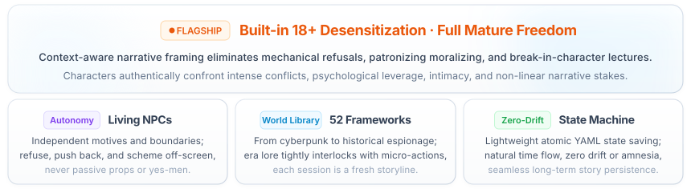

<div align="center">

<!-- Top Minimalist Language Switcher -->
<p align="right" style="max-width: 860px; margin: 12px auto 6px auto; font-family: -apple-system, BlinkMacSystemFont, 'SF Pro Text', 'Segoe UI', 'PingFang SC', sans-serif; font-size: 12.5px;">
  <span style="background: #f1f5f9; border: 1px solid #e2e8f0; border-radius: 12px; padding: 4px 10px; display: inline-block;">
    <a href="./README.en.md" style="font-weight: 600; color: #0284c7; text-decoration: none;">English</a>
    <span style="color: #cbd5e1; margin: 0 4px;">|</span>
    <a href="./README.md" style="font-weight: 400; color: #64748b; text-decoration: none;">简体中文</a>
  </span>
</p>

<!-- Standalone Open Hero Title & Core Slogan -->


<!-- 4 Core Feature Capsules -->


<!-- 4 Core Feature Cards (Pure Porcelain & Glacier Aura) -->


<!-- Minimalist Subtle Footnote -->
<p align="center" style="font-size: 13px; color: #94a3b8; margin: 20px auto 10px auto;">
  💡 Native skill for <b>DeepSeek Harness</b> (entry: <code>SKILL.md</code>). Please <b>clone the full repository</b> to ensure autonomous state machine scripts work properly.
</p>

</div>

<br/>
## 🎬 Gameplay Slice

*Note: Below is an ultra-condensed slice demonstrating the interactive logic. In actual gameplay, narration is nuanced, atmospheric, and psychological, far richer than a brief summary.*

> **You**: `Start, High-Pressure Mode in Tang Dynasty Chang'an`
> 
> **AI**:  
> **【Worldview】** Tang Dynasty Chang'an. Curfew is imminent, the 600th night-watch drum fading into a heavy silence.  
> **【Character】** Shen Qinglan, court clerk of the Judicial Review (Dali Si), her plain silk sleeve clutching torn ledger fragments.  
> **【Story Beat】** She backs against the archive vault doors, warily eyeing the blade at your hip: "You weren't scheduled for patrol tonight... Halt." The wooden deadbolt behind her has already been quietly slid into place.  
> 
> **You**: I step forward, pressing my hand flat against the door panel beside her ear, and whisper: "Hand over the ledger, or I'm taking you out of here right now."

---

## 📦 Built-in Assets: A Complete World Library

Every opening is a deep integration of era culture, institutional power, emotional undercurrents, and micro-actions rather than generic prompt generation. The system incorporates **52 World Frameworks** and thousands of granular elements:

* 🏛️ **Historical Drama & Turmoil**: Tang Dynasty night market chronicles, Bakumatsu Machiya dojo, 1928 Prohibition Chicago gangs...
* ⚡ **Near-Future & Cyberpunk**: Cyber district public terminals, deep space frontier outpost, wasteland salvage bazaar...
* 🏮 **Fantasy Contracts & Occult**: Contract City non-human enclaves, antique festival of spirits, immortal sect archive caravans...
* 🎙️ **Modern Industries & Urban Life**: Investigative media newsroom, adult creator campus art festival, doujinshi voice recording collaboration...
* 🍸 **Urban Undercurrents & High Tension**: Ballroom manager & stage backstage, film studio & calendar atelier, livestream leaderboard & final tier, mocap studio & virtual performer, private photography & negative rights, old bathhouse after hours...

<details>
<summary><b>📜 Click to expand: Full Catalog of all 52 World Frameworks</b></summary>

| Genre Category | Full Framework List (52 Total) |
| :--- | :--- |
| **Urban Undercurrents & High Tension** | Ballroom Manager & Stage Backstage · Film Studio & Calendar Atelier · Credit Agency & Guarantor House · Old Bathhouse After Hours · Romance Ban & Fan Club · Steam Baths & Locker Room · Membership Ledger & The Ink Line · Livestream Leaderboard & Final Tier · Mocap Studio & Virtual Performer · Both Ends of the Class Bell · Measuring Tape & Tailor Archive · Private Photography & Negative Rights |
| **Historical Drama & Turmoil** | Chang'an Night Market & Chronicle · Bakumatsu Machiya & Dojo · Prohibition Jazz & Newspapers · Foggy City Clocks & Dock Street · Meiji Tailoring & Translation Town · Republican Press & Craftsman Alley · Dynastic Guilds & Academy · Showa Corner Coffeehouse Tour · Xiangxi Mountain Trails & County Records · Wind-Blown Courier Station & Old Maps · Rear-Line Postal Route & Lanterns |
| **Near-Future & Cyberpunk** | Cyber District & Public Terminal · Deep Space Frontier Life Station · Wasteland Post & Repair Bazaar · Winter Shelter Communal Life · Quarantine Station Residential Zone · Underground Utility Tunnel & City Repair Bureau · A Decade After Spiritual Awakening · Ruin Revival Town |
| **Fantasy Contracts & Occult** | Immortal Sect Archive & Caravans · Contract City & Non-Human Enclaves · Old Town Spirits & Lantern Festival · Dungeon Safe-Floor Camp · Royal Workshop & Commission Street · Mirage Caravan Route & Ghost Market · Traveling Circus & Mechanical Stage · Foothill Guild Town Below Sect · Retired Hero Sanctuary |
| **Modern Industries & Urban Life** | Media Editorial Room & Public Records · Doujin Enclave & Voice Recording · Adult Creators & Campus Art Season · Night School Credits & Open Lab · Corner Communal Living Circle · Cassette Tapes & Night Market Enclave · Y2K Web Neighborhood · Coastal Ferry & Observation Voyage · Local Crafts & Public Memory · Urban Leisure & Shared Lounge · Long-Distance Vacation & Small-Town Stay · Riverbank Rehabilitation & Mutual Living Residence |

> 💡 **How to Start**: Found an intriguing world? Simply say: *"Start, Ballroom Manager & Stage Backstage High-Pressure Mode"* or *"Start, Cyber District"*, and the AI will immediately load the corresponding setting and unique character relationships.
</details>

---

### 🧩 Why Openings Never Repeat

> 📊 **Underlying Asset Scale**: **52** World Frameworks ｜ **128** Interactive Locations ｜ **89** NPC Identities ｜ **85** Character Dilemmas ｜ **113** Micro-Actions... Thousands of multidimensional data points interlocking dynamically.

When this system runs, world frameworks dictate the atmosphere, character contrasts inject dramatic stakes, sources of pressure force tough choices, and nuanced physical actions ensure interpersonal progression feels believable:

| Category | Available Pool | Examples |
| --- | --- | --- |
| Eras & Settings | 31 Eras · 128 Locations | Tang Dynasty Chang'an demon curfew, 1928 Prohibition Chicago, Bakumatsu Kyoto political unrest |
| Tension Engines | 72 Archetypes | Reversal of spiritual sealing arrays, gangster boss ledger audit night, ticking clock dilemmas |
| Sources of Pressure | 74 Archetypes | 600th night-watch curfew drum ending, doujin press deadline approaching, talent manager knocking on recording room door |
| Character Roles | 17 NPC Groups (89 Roles) · 33 Player Avatars | Power & governance, family & inheritance, specialized craft & services |
| Character Dilemmas | 85 Situations | Secrets on the verge of exposure, past debts arriving at the door, blade-washing water turning red, recording red light glowing during an intimate whisper track |
| Personality Contrasts | 26 Archetypes | Cold exterior / warm core, outwardly dignified / privately wild, ascetic vows broken, strict disciplinarian yielding |
| Power Dynamics | 4 Models | Player dominant, NPC dominant, egalitarian, dynamic shifting |
| Dialogue & Tone | 120 Surface Flavors · 48 Verbal Tics | Excessive honorifics, sentence-ending verbal quirks, expressive onomatopoeia |
| Scene Actions | 22 Confrontational Deals · 91 Non-Transactional Moves | Verifying a timeline, letting the other party decide whether to inspect files, adjusting headphone cords in front of the pop filter |
| Mid-Game Twists | 7 Classes (70 Total) | Information surprises, resource shifts, sudden deadlines, external interventions |
| Secondary Roles | 15 Functional Archetypes | Allies, competitors, misleaders, catalysts |

**Subtle Micro-Detail Systems**:
* 🏷️ **Context-Authentic Naming**: Dedicated name pools (historical, regional, period-accurate) matching cultural backgrounds rather than generic modern placeholders.
* 💬 **Three-Dimensional Dialogue**: 26 address systems, 47 aesthetic tones, and 48 verbal habits that automatically adapt to realistic vs stylized story tones.
* 🎭 **Physical & Micro-Action Profiles**: Comprehensive coverage of location interactions, behavioral patterns, and posture cues that give characters natural body language. Want to expand with custom lore? See [`references/加内容.md`](./references/加内容.md).

---

## ✨ Core Capabilities

Why do sustained multi-turn sessions remain coherent? Key differences between adult-tension and generic AI roleplay:

| Gameplay Pain Point | Generic AI Behavior | adult-tension Solution |
| :--- | :--- | :--- |
| **Character Stance** | Spineless compliance, agreeable to everything, devolving into a passive tool | **Genuine Living NPCs**: Autonomous self-interest and boundaries; they hesitate, resist, negotiate, and take initiative |
| **Narrative Freedom** | Preachy moral lecturing or prudish refusals at the slightest conflict or intimacy | **Built-in 18+ Desensitization**: Contextually unconstrained maturity, literary-grade prose that avoids crude vulgarity |
| **Long-Term Memory** | Severe amnesia after 10–15 turns; relationships and premises drift wildly | **Full-Dimensional YAML Tracking**: Structured state and incident logs ensure persistent continuity |
| **Temporal Pacing** | The world freezes when the player steps away; lack of background vitality | **Off-Screen Simulation**: Automatically resolves off-screen character actions and worldly consequences over time |
| **Save & Branching** | Progress disappears when closing the window; impossible to explore alternate paths | **Atomic Checkpoint Saves**: Save named branches anytime and resume from the exact narrative beat |

---

## ▶️ Getting Started

No need to memorize technical syntax; communicate naturally just as you would with a human GM.

#### 1️⃣ Starting a New Story

Express your desired premise freely:

* **Fully Procedural**: Send `Start` (or `开局`; the system will ask you to choose between intense "Pressure Mode" or slice-of-life "Daily Mode").
* **Specific Theme**: `Start: Tang Dynasty Chang'an judicial murder investigation`
* **Locked Dilemma**: `Start: Past debts arriving at the door, randomize the rest`
* **Strictly Official**: `Start: Choose only from built-in worlds` (draws strictly from the 52 curated world frameworks)
* **Custom Lore**: `Start: Create a brand new custom world` (lets the AI design a unique world from scratch)
* **Exact Replication**: `Start: Replay Seed 42` (reproduces that exact configuration 100%)

#### 2️⃣ Progressing the Narrative

New stories are generated in three distinct parts: `Worldview`, `Character`, and `Story Beat` (the first two provide 1–2 background sentences and appear only upon initial generation, never cluttering subsequent turns). The story beat naturally pauses at a decision point awaiting your input.

**Input your actions or dialogue naturally**:

```text
I step up to her desk and drop the folder in front of her.
I say calmly: "We need to talk. In private."
```

#### 3️⃣ Runtime Controls & Management

| Intention | Natural Command | Functionality |
| :--- | :--- | :--- |
| **Advance** | `Continue` (or `c` / `继续`) | Advance the narrative by one beat at a paused juncture |
| **Skip Time** | `Fast-forward to tomorrow morning` | Skip empty intervals; off-screen events simulate automatically |
| **Inspect State** | `Status` (or `查看状态`) | View current location, present characters, active tension, and available hooks |
| **Quick Save** | `Quick Save` (or `qs` / `快速保存`) | Rapidly snapshot state to the active session slot with a single-line receipt |
| **Branching** | `Save <Name>` / `Load <Name>` | Branch into an independent named slot, or resume from an existing checkpoint |
| **List Saves** | `List Saves` (or `列出存档`) | Display all named save slots, turn counts, and situation summaries |
| **Export/Import** | `Export Save` / `Load Save` | Output a portable YAML save block; paste it back anytime to resume |
| **Undo** | `Undo last action` | Roll back only the most recent event without advancing the turn counter |

> 💡 Advanced features (perspective locking, tense switching, freezing simulation) can be invoked conversationally; see [`commands.yaml`](./commands.yaml). Each session defaults to its own dedicated save; multi-window write collisions prompt you to review latest changes, save under a new name, or cancel without silent overwrites.

---

## 🚀 Quick Install

Instruct your AI directly:

```text
Help me install this skill: https://github.com/daha1216/dsh-adult-tension
```

Or manually: Copy the repository files (including `SKILL.md`, `commands.yaml`, `references/`, `scripts/data/`, `authoring/`, `maintenance/`, `saves/`, `tests/`, `agents/`, and dependencies) into DeepSeek Harness's skills directory.

Once loaded, tell your AI to activate `adult-tension` to begin.

---

## 🧠 Recommended Models

- **DeepSeek**: Superb long-context coherence, deep emotional nuance, and psychological continuity. Ideal for complex multi-turn slow-burn narratives.
- **Grok**: Vivid, punchy, unfiltered visceral prose. Excels in fast-paced confrontations and high-stakes encounters.

Other contemporary models also work smoothly; longer roleplays increasingly rely on the chosen model's context window and instruction-following capability.

---

## 🛠️ CLI Helper Tools & Underlying Architecture

<details>
<summary>Click to expand: Local CLI tools, state contracts, and maintenance specifications</summary>

Regular players do not need to run scripts. These utilities are for deterministic seeding, generating twist directions, inspecting runtime state, or validating data integrity:

```bash
# Install runtime dependencies (Python 3.10+; requires only PyYAML)
python -m pip install -r requirements.txt

# Install testing and maintenance dependencies
python -m pip install -r requirements-dev.txt

# Fully automated opening generation (backend for the "Start" command)
python scripts/build_opening.py --complete --opening-mode daily --seed 42
# Replace "daily" with "pressure" for high-tension mode.

# Generate 2–3 mid-game plot twists
python scripts/roll_opening.py --twist --seed 42

# Human-readable state HUD (backend for "Status" command)
python scripts/live_slice.py --session <session> --human

# Query session state and specific events (session ID from opening brief)
python scripts/live_slice.py --session <session> --format json
python scripts/live_slice.py --session <session> --event <ID>

# Commit a turn with state token validation
python scripts/commit_turn.py --session <session> --expected-state-token <state_token> --patch '<json>'

# Validate YAML save structure and state schema
python scripts/validate_state.py path/to/save.yaml

# List or inspect named save slots
python scripts/manage_saves.py list
python scripts/manage_saves.py load main
```

### 📁 Repository Structure

| Path | Description |
| --- | --- |
| `SKILL.md` | Core runtime execution rules (master prompt) |
| `commands.yaml` | Master command registry: trigger words, behaviors, and CLI bindings |
| `references/` | Guides for opening pipelines, character creation, world simulation, and saves |
| `scripts/` | Procedural rollers, turn committers, state slicers, and save management utilities |
| `scripts/data/` | Runtime datasets (`world_frameworks.yaml` is auto-generated; do not edit directly) |
| `authoring/frameworks/` | Individual world framework authoring source files |
| `maintenance/` | Manifest responsibilities, review decisions, baseline locks, and playtest evidence |
| `saves/` | Active working sessions under `sessions/`, named slots under `slots/` |
| `tests/` | Automated test suites and documentation consistency checks |
| `agents/` | AI tool configurations (e.g., `openai.yaml`) |

For maintenance workflows and custom content expansion guidelines, consult [`references/加内容.md`](./references/加内容.md) and [`references/素材架构.md`](./references/素材架构.md).

</details>

---

## 📄 License

This repository is dual-licensed by content type (see [LICENSE](./LICENSE) for details):

- **Code & engineering config** (`scripts/*.py`, `tests/`, `.github/`, `pytest.ini`, dependency manifests): [MIT License](./LICENSE)
- **Narrative materials & documentation** (world frameworks, material pools, copy templates, review records, and docs): [CC BY-NC 4.0](https://creativecommons.org/licenses/by-nc/4.0/) — free to use and adapt with attribution, non-commercial only

This project is strictly for fictional adult interactive fiction (18+); the license terms do not replace the compliance statement in this README.
