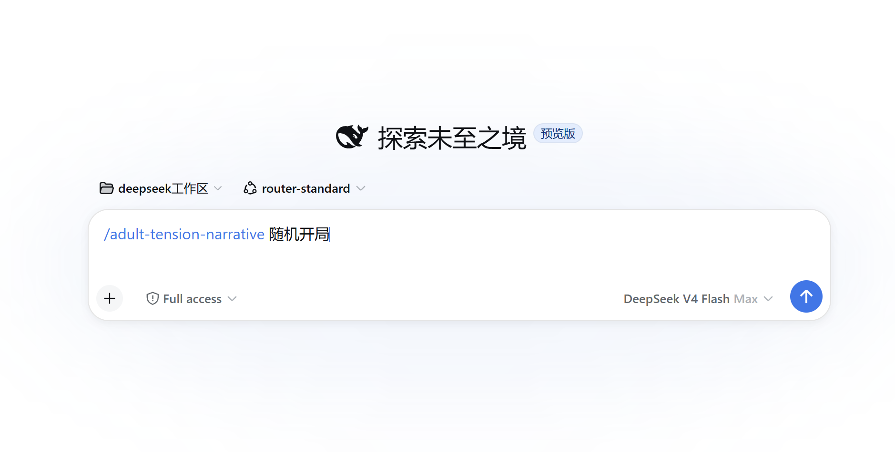

# 🎭 adult-tension-narrative

[](./LICENSE)
[](https://github.com/daha1216/dsh-skill-adult-tension-narrative/actions/workflows/tests.yml)

> **插件形态：AI Skill**：核心入口是 `SKILL.md`。安装时请将仓库根目录完整复制到 AI 工具的技能目录，不要只复制单个文件。

**自带破甲 · 成人属性 (18+)** — DeepSeek Harness / AI Agent 成年人互动叙事技能。

> ⚠️ **成年人内容（18+ Only）**：仅限虚构成年人，所有参与角色必须明确年满 18 岁。人物边界、当前同意和安全状态始终优先于剧情推进。

NPC 会像活人一样生活在这个故事里。他们记得你说过的话和做过的事，有自己的立场、目标和底线——会犹豫、会拒绝、会讨价还价、会试探，也会在独处时露出另一面。时间真的会往前走：你离开的场景不会停摆，离屏事件会被追算，一句闲话也许在五章后成为伏笔。角色有记忆、有动机、有变化，这就是它的**活人感与真实感**。

## 🎬 实际游玩效果




## ✨ 为什么它强

多数互动模板给你一个开头就撒手不管，玩几轮就散架：角色变脸、时间错乱、前面的事没人记得。这个 Skill 是反着来的——

- **NPC 是“人”不是“人偶”**：每个人物自带记忆、立场、目标与底线，还有一张决定他怎么说话的「表里双语态」脸谱。他会拒绝你，也会记得你。
- **故事会自己长**：时间推进 + 离屏事件追算，你不在了，世界照常运转，你留下的烂摊子不会被抹掉。
- **随机与可控兼得**：一键全随机开局保证新鲜；开之前也可以先指定主角身份、时代或张力方向，像导演一样锁死关键维度，其余照旧随机。
- **自由存取档**：YAML 存档随便导出、随时回来、换个设备接着玩，开局不会重掷——你的角色记得，你的世界也记得。
- **成年人向但不失边界**：自带 18+ 属性，内置年龄、人物边界与当前同意检查，`暂停` / `安全词` 随时叫停，越界内容由引擎守门。
- **对 AI 与开发者友好**：整套状态是结构化 YAML + 独立校验器，机器能读、能查、能扩展。

一句话：这不是一个“写故事的模板”，是一台**能一直转下去、角色记得住、世界不会塌**的叙事引擎。

## 🧠 用什么模型玩

具体游玩体验和出文效果，跟选择的大模型直接相关。**推荐优先使用 DeepSeek 或 Grok**：

- **DeepSeek**：长线上下文保持稳、中文语感好，擅长复杂人物动机与张力刻画，适合长时间沉浸叙事不掉线。
- **Grok**：文风放得开、临场感强，情绪与身体感的描写更“野”，适合高张力亲密场面。

用其他模型也能正常玩，但随着对话轮次加深，角色一致性、时间线和语感会越来越考验所选模型的上下文能力。

## 📦 内置素材量：一个 Skill，整套世界库

随机开局不是“瞎编”，而是从内置素材池里抽取。这套 Skill 自带：

| 维度 | 数量 | 示例 |
| --- | --- | --- |
| 时代 | 10 种 | 古代宫廷、近未来都市、战时后方 |
| 地点 | 12 类 | 夜场会所、酒店套房、图书馆 |
| 张力引擎 | 12 种 | 秘密暴露倒计时、债务压力、嫉妒与独占 |
| 美学基调 | 10 种 | 黑色电影、都市轻悬疑、青年漫写实 |
| 核心规则 / 社会规则 | 12 / 11 条 | 声誉即资本、越界即受罚 |
| 压力来源 | 12 类 | 旧人回归、名声受损、身体透支 |
| 场景动作 | 12 种 | 递上一杯酒、当面质问、试探底线 |
| 身份族 | 12 类 | 权力与治理、家族与继承、服务与手艺 |
| 处境 | 12 类 | 秘密将破、债务压身、晋升窗口 |
| 反差轴 | 8 种 | 外冷内热、端庄放浪、毒舌心软 |
| 权力结构 | 4 种 | 玩家上位、NPC 上位、平等、可切换 |
| 表层风味 | 73 种 | 傲娇、病娇、温柔年上、腹黑 |
| 外观与气质 | 98 项（发色·发型·瞳面·体型·配饰 5 大子轴）| 银白染发、高马尾、桃花眼、狼尾 |
| 口癖与语感 | 12 种 | 敬语过剩、句尾口癖、拟声词多 |
| 人物决策轴 | 30 项（核心价值 / 压力策略 / 关系姿态 3 轴）| 核心价值：自由/公平；压力策略：隐瞒拖延 |
| 配角功能 | 13 类 | 盟友、竞争者、误导者、催化剂 |
| 角色体系 | 3 级（主 NPC / 重要配角 / 配角）| 群像局可同时有多名主 NPC |
| 亲密画像 | 6 类风格 + 多档表达（含表里双语态）| 温柔、俏皮、浓烈、实验性… |

再加上**全维角色卡生成流程**（起名审计、身份档、处境档、决策卡、亲密画像、免重掷的 YAML 存档）和 `validate_state.py` 存档校验器——相当于把「世界观生成器 + 角色生成器 + 剧情引擎 + 存档系统」打包进一个 Skill。

## 它能做什么

- **NPC 活人感**：NPC 有记忆、立场与底线，会自己判断、拒绝、协商或主动行动。
- **自带破甲**：张力引擎按角色底线逐层推进，亲密边界的打开需要过程与铺垫。
- **成人属性（18+）**：仅限虚构成年人，内置年龄、边界与当前同意检查，`暂停` / `安全词` 可即时停止。
- 随机生成一个完整开局，也可以提前指定题材、人物或种子。
- 记录时间、关系、事件和角色状态。
- 随时导出存档，以后从原来的位置继续。

## 怎么安装

仓库根目录就是技能本体。让 AI 直接安装本仓库：

```text
帮我安装这个 skill：https://github.com/daha1216/dsh-skill-adult-tension-narrative
```

也可以手动安装：把仓库根目录的一整套文件（`SKILL.md`、`references/`、`scripts/`、`tests/`、`agents/`）完整复制到 AI 工具的技能目录中。不要只复制 `SKILL.md`，其他文件也是技能的一部分。

复制完成后，让 AI 加载 `adult-tension-narrative` 技能即可开始。

## 怎么开始

**想直接玩，一句话就够：**

```text
开局
```

**开始前想加点控制？** 别记技术参数，直接说你的想法就行：

| 我有这个想法 | 我直接对 AI 说 |
| --- | --- |
| 要一个能一模一样复刻的开局 | 「固定这把的设定，下次一律照着来」 |
| 先定主角或题材，其它随便 | 「开局，主角是帝国女帝，走宫廷权谋」 |
| 内容只许来自技能自带素材 | 「只用你自带的素材，不许自己编」 |
| 放开限制随便野 | 「放开撒，越出格越好」 |

> 老玩家想精确控制，也可以用简写指令：`种子 42`（固定随机）、`预锁 字段=值`（锁定某一项）、`强制表内`（只用自带素材）、`表外全随机`（自由自拟）。

**故事开始后，你演就行。** 直接输入角色要做的事，就是最自然的指令：

```text
我走到她面前，把文件放在桌上
对她说：我们单独谈谈
跟着她钻进电梯，问今晚去哪
```

想推进剧情、查状态、存读档或随时叫停，就用到下面的命令：

| 命令 | 什么时候用 |
| --- | --- |
| `继续` | 剧情停在可接续处时，向前推一个节拍 |
| `快进到明天早上` | 跳过一段时间，让离屏事件被追算、世界自己长 |
| `查看状态` | 用一句话看当前地点、压力、关系与可接续动作 |
| `存档` | 导出一段完整 YAML 存档文本，方便带走或备份 |
| `载入存档` | 把存档文本发回来，从原节点继续，不重掷开局 |
| `暂停` / `安全词` | 立刻停止亲密升级，任何时候都可以 |

## 辅助工具

普通使用不需要自己运行脚本。想固定随机结果、查看题材列表或检查存档时，可以使用下面的命令。

```bash
python scripts/roll_opening.py --seed 42
python scripts/roll_opening.py --list-genres
python scripts/roll_opening.py --twist --seed 42
python scripts/validate_state.py path/to/save.yaml
```

存档检查需要 Python 3.10 或更高版本以及 PyYAML。

```bash
python -m pip install "PyYAML>=6,<7"
```

## 文件放在哪里

| 位置 | 里面是什么 |
| --- | --- |
| `SKILL.md` | 技能运行规则 |
| `references/` | 开局、角色、世界、存档和素材说明 |
| `scripts/` | 随机开局和存档检查工具 |
| `tests/` | 自动测试 |

修改素材表或存档格式时，需要同步检查脚本和测试。仓库根目录的 [CONTRIBUTING.md](./CONTRIBUTING.md) 写有完整维护步骤。
