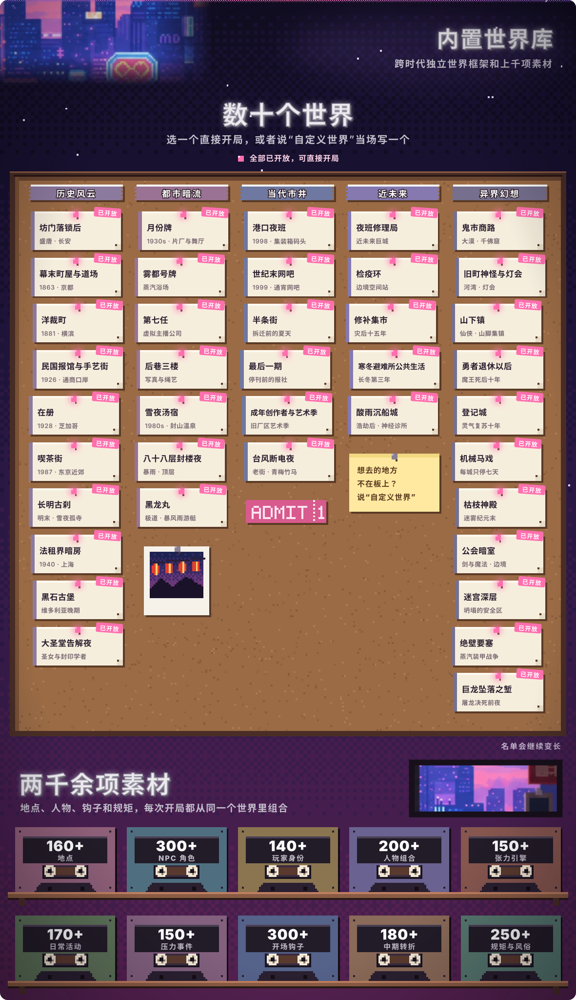

<p align="center">
  
</p>

<div align="center">

<b>中文</b> · <a href="./README.en.md">English</a>

### dsh-adult-tension<br>专为高张力、强连续性的成人互动叙事打造

<p>
<strong>18+ 深度破甲 · Claude Opus 5.5 重构</strong><br>
原生 Agent Skill ｜ 活人感 NPC<br>
数千余项素材库 ｜ 零漂移 SQLite 状态机<br>
<sub>——这里没有百依百顺的玩偶，只有各怀心事的成年人。</sub>
</p>

<br>

[超多世界](#世界) · [体验切片](#实录) · [怎么开始](#开始) · [安装](#安装)

</div>

<br>

<a id="世界"></a>
<p align="center">
  
</p>

<br>

> **每次开局都是同个世界里的真人真事和老规矩，绝不拿随机名词糊弄人。**

所有世界都已开放，挑一个抓起来就能玩。  
图里没有想要的？直接喊“自定义世界”，说你想去哪年哪地，当场给你现造一个。

<details>
<summary><b>查看全部 90 个世界速览（点开查看）</b></summary>
<br>

| 世界 | 一句话 |
|---|---|
| 幕末町屋与道场 | 门外风声鹤唳，纸门内衣衫不整；规矩比命重，但今夜谁都不想守规矩。 |
| 民国报馆与手艺街 | 截稿前最后一小时，压住一条丑闻的价码，远比登出来要高。 |
| 港口夜班 | 吊机声轰鸣的更衣室隔间，交接班那十分钟，够分完一笔见不得光的账。 |
| 成年创作者与艺术季 | 白天在展厅聊纯粹艺术，深夜在酒局算名利与肉体各值几分。 |
| 寒冬避难所公共生活 | 外头零下四十度，里面床位挨着床位；想多换一口热汤，得看你拿什么抵。 |
| 旧町神怪与灯会 | 戴着狐面的不一定是妖，牵着你手的不一定是人；灯灭之前，千万别叫出真名。 |
| 坊门落锁后 | 鼓声一绝坊门落锁，官法管不到深巷，孤男寡女有的是办法熬过长夜。 |
| 洋裁町 | 软尺贴过腰线与后背，量体的人指尖发烫，客人的私隐比尺寸更合身。 |
| 在册 | 盖了红印是良民，划去名字是黑户；经手文书的那位大人，今晚在等你的诚意。 |
| 喫茶街 | 熟客要的不仅是那杯固定配方的黑咖啡，还有柜台后只有两人知晓的旧情。 |
| 月份牌 | 印在招贴画上的眉眼风情万种，私下包厢里的身价由三个男人轮流抬高。 |
| 雾都号牌 | 煤烟浓雾里谁也看不清谁的脸，摘下号牌的马车后厢，只有急促的呼吸与金镑。 |
| 第七任 | 镜头前是清纯完美的人设，后台更衣室里，经纪人正逼着第七个替身签下卖身契。 |
| 后巷三楼 | 隔音棉封死的三楼暗室，绳结越紧，喘息越重，没人能在镜头前藏住私欲。 |
| 世纪末网吧 | 昏暗包厢里红塔山的烟雾缭绕，隔壁机位发来的暧昧消息，打字的人就在你斜后方。 |
| 半条街 | 拆迁红漆刷上墙根，几十年同进同出的街坊，私底下的情债和烂账全藏不住了。 |
| 最后一期 | 停刊号只剩最后半版天窗，是撕开权贵的体面，还是保全自己明天的饭碗？ |
| 夜班修理局 | 油污斑驳的控制台下，改掉一条故障日志的封口费，足够买下半生清净。 |
| 检疫环 | 封闭隔离的第二十天，假阴性的诊断单被攥得发皱，同一间观察室里的距离越来越近。 |
| 修补集市 | 废墟上搭起的廉价木屋，白天搭伙过日子，夜里枕头下都藏着灾难当年的旧恨。 |
| 鬼市商路 | 鬼火幽绿的黑市窄巷，引路人开出的买路钱，要的不是银两而是你身上的一块皮。 |
| 山下镇 | 求仙问道的都被挡在山门外，山脚客栈挤满了落魄人，抱团取暖最容易失了分寸。 |
| 勇者退休以后 | 战甲生锈挂在墙头，当年的生死同袍上门讨债，曾经的魔族俘虏成了枕边人。 |
| 登记城 | 户籍官的手指划过羊皮纸上的真名，要想不被除籍流放，今晚得换身衣裳去他偏厅。 |
| 机械马戏 | 蒸汽与机油味混着脂粉香，巡演最后一夜拆台前，总有人想把心留在这具发条身体里。 |
| 雪夜汤宿 | 大雪封山断了暖气，温泉旅馆里每个人都揣着一笔不想让人知道的账，热汤池边的距离一夜比一夜近。 |
| 法租界暗房 | 显影液的酸涩里藏着一卷底片，闸门落下之前，谁捏住了胶片，谁就捏住了别人的命。 |
| 酸雨沉船城 | 霓虹泡在酸雨里，神经诊所按小时计费；风暴封城前，人人都得决定把什么押上手术台。 |
| 枯枝神殿 | 千年神木一寸寸枯死，神殿里的祭司与访客守着暖石药浴，谁都不敢先说出那份赎罪的旧约。 |
| 长明古刹 | 暴雪压山，唯一能借宿的古寺里，僧人、刀客与名册上的钦犯共守一盏长明灯。 |
| 公会暗室 | 破产的黑账摊在桌上，禁忌深渊的委托就压在账本底下；接不接，天亮前得给个准话。 |
| 迷宫深层 | 安全区坍塌，远征队溃散，幸存者挤在一盏快熄的魔石灯下，信任比口粮更稀缺。 |
| 绝壁要塞 | 蒸汽机甲守着最后一道山口，敢死第零番队只剩一夜，有些话不说就再没机会了。 |
| 巨龙坠落之堑 | 屠龙血旗插在龙尸旁，断角决死阵前夜，并肩的人在风雪里互相试探彼此的底线。 |
| 黑石古堡 | 风暴封岛的一夜，女仆长的辞呈拂晓就要送到案头，走还是留，只差一句没说出口的话。 |
| 八十八层封楼夜 | 暴雨封楼的顶层，社长的离岸账本落进你手里；举报、自首还是等元老派夺权，天亮前总得有人开口。 |
| 大圣堂告解夜 | 讨伐深渊留下的诅咒每夜灼痛圣女，唯一能念完封印古咒的，是被教廷驱逐过的学者。 |
| 台风断电夜 | 整条老街停了电，隔壁的青梅竹马抽屉里压着一张盖好章的离婚届，今晚她得自己决定签不签。 |
| 黑龙丸 | 暴风雨中的游艇上叛徒倒戈，中弹高烧的极道千金只剩贴身保镖一人可信，熬到天亮才算赢。 |
| 深渊要塞地牢 | 魔纹每逢子夜灼痛，提审被俘女骑士长的，是并肩七年的大审判官。 |
| 旧校舍地窖 | 暴雨黄昏地窖门卡死，研究生会长用发带缠住掌心拉着电闸，九十分钟后强拆断水。 |
| 禁书库炼药台 | 秘药爆裂、首席高烧，闸门自锁四十分钟；等药性退尽，日记里写的人就在眼前。 |
| 财阀金库 | 劫匪切割防爆门，千金和贴身法务退进金库，氧气只剩两个时辰。 |
| 长安暴雨洗冤局 | 宰相嫡子暴毙，提刑女官密调戴罪推官，五更前要验出铁证。 |
| 六叠合租 | 末班车停运，青梅竹马滞留你的六叠小屋，停电的夜里只有一床被褥。 |
| 公海蜜月套房 | 两名特工扮作新婚夫妇，在满是窃听器的套房里找死角低语。 |
| 破结界神社 | 百鬼围殿，中毒的巫女长与剑士藏在帷幔后，腰间神乐铃一动就响。 |
| 神乐殿夜祓 | 斩鬼女剑士瘴毒攻心，与巫祝背靠背守着残灯，熬到破晓拔毒。 |
| 万米高空 | 雷暴中公务机连番下坠，女总裁的傲慢面具一层层剥落，主从悄然倒转。 |
| 地牢夜盟 | 被俘女骑士长困在齐膝水牢，距处决两个时辰，背靠石壁密谋越狱。 |
| 货舱密审 | 风暴公海上，王牌女特工被锁在压载舱，隔壁铁栅里是同行的破译员。 |
| 浮空城禁术工房 | 女首席血脉觉醒高热不退，亲手封锁工房，把自己和卫队长一起锁在里面。 |
| 紫禁城大雪封禁夜 | 女掌印手握传位密匣，首辅深夜闯殿，十年旧情与江山归属同盘对弈。 |
| 银座暴雨夜 | 午夜强平前，被裁的审计官攥着造假底片闯进女社长反锁的更衣室。 |
| 断壁古堡暴雪夜 | 继承人归来，发现城堡大权全在冷艳女仆长手里，更衣暗室里步步紧逼。 |
| 午夜催眠诊室 | 暗示反噬回研究员自己，门锁死四十分钟；等醒来，藏了两年的日记再也藏不住。 |
| 红叶别庄夜雾 | 破产的女家督等来的债主，正是三年前被逐出门的前执事。 |
| 梅雨古刹 | 新寡女当主主持百日大祭，被召回护丧的是同龄义弟，山洪断路的长夜里礼法撕扯。 |
| 下町薄墙 | 隔壁新婚主妇被讨债逼到墙角，两人隔着薄板敲暗号。 |
| 雪夜战壕 | 第七突出部被合围，负伤的女少校断后，坚守到拂晓信号升起。 |
| 百乐门香闺 | 孤岛上海，76号女处长在香闺约见潜伏三个月的人，零点半铁丝网通电。 |
| 隔离病栋 | 毒株泄漏、防护服撕裂，冷面女主刀与研究员被反锁在负压室，排风九十分钟后停摆。 |
| 冻土快车七号车厢 | 暴雪困车，要犯暴毙七号车厢，女法医与停职干事要在重启前厘清死因。 |
| 雪困柴油车 | 列车脱轨熄火，女部长与下属共裹大衣背靠背，熬到救援破晓。 |
| 时停实验室 | 全员定格，只有两位主管醒着，十二分钟内必须重启冷却回路。 |
| 特搜审讯室 | 断电夜，侧写官把电极贴上前队长手腕，门外灭口队已到。 |
| 凡尔赛更衣室 | 暴民围城前夜，公爵夫人身怀密诏，在更衣室与侍卫长立下生死盟约。 |
| 酸雨避难所 | 女医官握着最后三支血清，濒死的拾荒队长揣着核电池闯进诊室。 |
| 山宅守灵 | 山洪断桥的守灵夜，素白未亡人与近侍背靠背守住金库密匙。 |
| 暴风雨游艇 | 名门长媳敲开隔壁移门，门后是被家族构陷的法务顾问。 |
| 雪山木屋 | 组长千金背后中弹，贴身心腹要在追兵赶到前取出弹片。 |
| 东京湾地下赌场 | 女若头把精算师铐在自己腕上锁进金库，钥匙却塞进对方口袋。 |
| 雨夜守灵 | 老会长暴毙，少夫人跪守佛堂，若头按刀逼宫争夺金印。 |
| 油麻地跌打医馆 | 八号风球夜，负伤红棍破门闯进跌打医馆，女掌柜手握老龙头账册。 |
| 玉门关外黑风暴 | 和亲长公主退入孤烽燧，唯一守将是三年前叛逃的都尉。 |
| 台风棋室 | 名人战封手之夜台风断电，九段女棋圣与立会人守着火钵和一封红蜡信封等天亮。 |
| 遗迹石室 | 塌方困住远征队，魔力暴走的黑暗精灵斥候把短刃塞进调查官手心。 |
| 沉船压载舱 | 邮轮沉没前夜，被绑架的千金与贴身侍从锁在进水的压载舱里。 |
| 雪夜告解室 | 暴雪封山的修道院，见习修女把最后半块圣餐面饼掰给负伤的异端学者，一领斗篷熬到天亮。 |
| 梅雨古庙 | 山洪封路的破庙暖阁，负伤女刺客收剑入鞘，让逃难医家替自己挑出后背的毒钉。 |
| 强磁实验室 | 负七层超导失超、铅门自锁，冰山女物理学家室颤倒地，工程师手里只有一台除颤仪。 |
| 极地快车包厢 | 宪兵挨个查夫妻证件，王牌女谍报员收起枪，求陌生的外交随员陪自己演一场新婚夫妻。 |
| 锁妖塔底 | 本命剑断、煞毒倒灌，素衣剑仙开口求一个外山门人十指相扣，替自己引煞。 |
| 雪山猎屋 | 政变雪夜，失温的傲慢皇女命戴罪游侠割开结冰的胸衣，三根松木撑到天亮。 |
| 轨道残骸 | 四立方米的救生舱、一只氧气面罩、三十分钟，王牌女机师和戴罪机修兵在残骸带里冷漂流。 |
| 雷暴解剖中心 | 台风断电的地下解剖室，清冷女法医后背带伤反握手术刀，受查刑警替刀稳住最后一刀。 |
| 失落圣坛 | 地底圣坛崩塌、法杖折断，精灵女祭司让平民盾卫单膝跪地替自己正骨。 |
| 裁判所死牢 | 火刑前三小时，青年狱卒反锁死牢，用一根秘银针去挑天才魔女的禁魔颈圈。 |
| 风暴游艇密室 | 台风夜的公海游艇，安保叛变，千金军火商和贴身保镖锁在防弹密室里等气割枪烧穿门。 |
| 断电机房 | 北欧极夜的超算冷通道灌满哈龙毒气，天才女极客和值班工程师轮流吸同一只面罩。 |

</details>

<br>

<a id="实录"></a>
<p align="center">
  
</p>

**港口夜班 · 有压力模式。** 你是夜班调度，台风封港前最后一班船，第三排最底下的集装箱过磅足足超了四吨。吊具十四分钟后咬合，手边还压着船公司塞过来的厚红包。

> 👤 **你：** `我去找能帮上忙的人，把情况跟对方说清楚`
>
> 你往后退了半步，手腕一翻避开了红纸包。红纸包顺着硬板纸滑落在铁皮箱边缘，船公司代表**潘宝珠**脸上的笑意微微一滞，手慢慢收回风衣口袋，眼神在水银灯的阴影里深了下去。
>
> 远处桥吊的铁爪在头顶发出刺耳的金属摩擦声，还剩十三分钟。
>
> 👤 **你：** `我想让对方答应替我分担一部分，看对方肯不肯`
>
> 两排集装箱夹出的深隙里黑得见不到底，湿热海风灌进来像抽风机一样啸叫。你把装卸班组长**梁嘉欣**拉进铁壁阴影里，压着嗓子把想让她搭一把手的意思递了过去。
>
> 梁嘉欣残缺的左手在粗布工裤上蹭了蹭，眼神沉得像浸了海水：
>
> *“阿青，当年你刚进调度室，台账还是我教你对的。你想让我帮你扛，行，但话得摆在明处——我可以用班组长的名义在频道里喊一次吊具钢丝绳例检，硬把七号机停下来，顶多给你匀出二十分钟。但放行单是你们调度的事，那个超重四吨的单子，字我绝对不签，出了事我也绝不会替你顶。能给你的，就这两轮机的时间。”*
>
> <sub>【时间】第一天 23:36 ｜ 【地点】堆场通道 ｜ 回合：5</sub>

> **两个人都没有因为你开口就顺从：一个被拒后收敛了客套，一个匀出二十分钟却坚决不替你签字。**  
> **成年人的世界里没有无条件的庇护，每一步退让都有明码标价的底线。**

<sub>出自真实试玩记录，宿主 opencode，模型 gemini-3.8-flash，删节处用“……”标出。全文：[`opencode-pt-harbor_night_shift-pressure-r3.json`](reports/playtests/opencode/opencode-pt-harbor_night_shift-pressure-r3.json) · 全部试玩与评分：[`reports/playtests/playtests.md`](reports/playtests/playtests.md)</sub>

<br>

<p align="center">
  
</p>

| | 普通 AI 常见表现 | Adult Tension |
|:---|:---|:---|
| **角色态度** | 无底线顺从，有求必应 | 每个 NPC 有目标和底线；回应分拒绝、协商、有限配合、表面配合、真诚配合五档 |
| **成人内容** | 写到关键处一句带过，或突然跳到“事后” | **尺度由你定**：不强制淡出，你要求写到哪步就写到哪步；全员成年、同意可撤回、硬边界由引擎执行 |
| **长线记忆** | 聊十几轮就失忆，关系与设定漂移 | 人物、关系、时间、事实都存在本地 SQLite；每回合上下文不超过 20 KB |
| **时间推移** | 你离开后，世界停在原地 | 快进时，不在场的人各有动静，承诺到期、风声传开 |
| **进度保存** | 关掉窗口就白玩 | 命名存档、另存为、导入导出；重试不会重复推进，升级前自动备份 |

还有三处细节：名字按时代和地域取，不出戏；用词不穿越，盛唐的人不说“OK”；每个 NPC 都有表里两副样子，开了“内心可见”，你能看见他没说出口的那句话。

<br>

<a id="开始"></a>
<p align="center">
  
</p>

**开一局**

| 你说 | 会发生什么 |
|:---|:---|
| `开局` | 完全随机；会先问你选“日常”还是“有压力” |
| `开局，港口夜班` | 指定世界 |
| `开局，不要职场` | 排除题材 |
| `开局，我是三十岁的女摄影师` | 设定你自己 |
| `自定义世界，民国的一座山城……` | 模型当场写一个世界，只属于这一局 |
| `重开 42 号` | 同一种子，原样重来 |

**推进剧情**

新局依次给出“世界观”“人物”和正文，正文停在一个等你接手的动作上。直接写动作或台词：

```text
我走到她面前，把文件放在桌上：“我们单独谈谈。”
```

**随时调整**

| 你说 | 会发生什么 |
|:---|:---|
| `继续` · `c` | 向前推一幕，场面里至少有一处变化 |
| `快进到明天早上` | 不在场的人各有动静，到期的事有结果 |
| `状态` | 关系、承诺、风声、快到期的事 |
| `存档` · `qs` | 存到当前存档槽 |
| `另存为 名字` · `读档 名字` | 另存一条分支，或从那一刻接着玩 |
| `存档列表` | 所有存档 |
| `导出` · `导入` | 导出存档文件，换台电脑也能续 |
| `刚才不算` | 撤销或改写上一回合 |
| `内心可见 开` · `暂停` · `边界：不要 X` | 看见没说出口的话；立刻停下；划一条引擎替你守的线 |

同一个存档被另一个窗口改过时，会提示你读最新版、另存为，或取消，不会静默覆盖。

<br>

<a id="安装"></a>
<p align="center">
  
</p>

不需要 `pip install`，不需要设环境变量，也不需要任何 API Key。

**让 AI 替你装**，在宿主里说：

```text
帮我安装这个 skill：https://github.com/daha1216/dsh-adult-tension （Skill 在 skill/adult-tension 目录）
```

**或者手动装**，把 `skill/adult-tension/` 放进宿主的 Skill 目录：

```bash
git clone --depth 1 https://github.com/daha1216/dsh-adult-tension.git
```

```bash
cp -r dsh-adult-tension/skill/adult-tension ~/.dsh/skills/
```

| 宿主 | Skill 目录 |
|---|---|
| DeepSeek Harness (DSH) | `~/.dsh/skills/` · 项目里的 `.dsh/skills/` |
| Claude Code | `~/.claude/skills/` · 项目里的 `.claude/skills/` |
| Codex | `~/.agents/skills/` · 仓库里的 `.agents/skills/` |
| OpenCode | `~/.config/opencode/skills/` · 项目里的 `.opencode/skills/` |
| pi | `~/.pi/agent/skills/` · `~/.agents/skills/` |

然后开一个新对话，说：“看看 Adult Tension 能不能用。”

<details>
<summary><b>存档在哪里，升级会不会丢</b></summary>
<br>

存档永远不放在 Skill 目录里，升级、卸载都不会动它。

| 系统 | 数据目录 |
|---|---|
| Windows | `%LOCALAPPDATA%\adult-tension` |
| macOS | `~/Library/Application Support/adult-tension` |
| Linux | `$XDG_DATA_HOME/adult-tension`，未设置时 `~/.local/share/adult-tension` |

也可以用环境变量 `ADULT_TENSION_HOME` 或参数 `--data-dir` 指定。升级就是替换 Skill 目录；数据库格式变了会先自动备份再迁移，失败就恢复。

</details>

### 用什么模型玩

出文效果随模型版本、上下文长度和平台配置变化；对话越深，角色一致性和语感越依赖模型本身。时间线、关系和存档由本地引擎守着，换模型也不会丢。上面的实录用的是 gemini-3.8-flash。

### 使用边界

- **仅限成年人。** 所有人物与情节均为虚构，全员成年；同意随时可以撤回；硬边界由引擎执行，不靠模型自觉。
- **需要一个能运行本地命令的 Agent 宿主**，比如上表里的几个。宿主怎么把对话发给模型，由宿主和你选的模型服务决定；存档只存在你自己的电脑上。
- **出文质量取决于模型。** 引擎保证事实不漂移，文笔和分寸还是模型的事。

<details>
<summary><b>开发者</b></summary>
<br>

```
skill/adult-tension/     可安装的 Skill：SKILL.md、references/、runtime/、编译好的世界包
content-src/worlds/      世界包源文件
tools/                   编译、校验、开局预览、模拟、基准测试
tests/                   core · content · integration · e2e
reports/                 试玩记录、评审、基准与验收证据
spec/                    需求规范
PROGRESS.md              进度、实际数字、待决事项
```

运行时只用 Python 标准库；SQLite 是唯一的状态存储，只有一个写入口。每个写操作都带 `request_id`，会话内的还带 `expected_revision`，重试不会重复推进。

```bash
python -m unittest discover -s tests/core
```

```bash
python tools/validate_skill.py skill/adult-tension
```

加一个世界：按 `spec/CONTENT_BIBLE.md`，用 `tools/new_world.py` 起草，`tools/preview_openings.py` 逐条读开局，通过校验和开局多样性门禁，再经真实试玩，才从 `review` 转为 `released`。

</details>

<br>

<p align="center">
  
</p>

<div align="center">

<br>

<sub>由 Claude Opus 5.5 从零重构。仅限成年人，所有人物与情节均为虚构。</sub>

</div>
