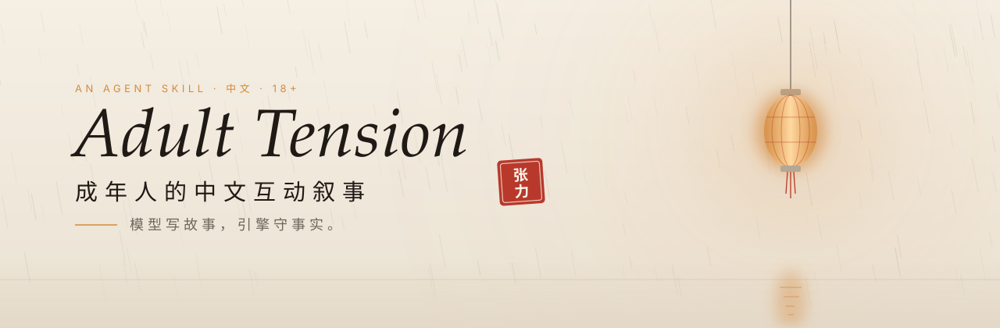

<div align="center">

<picture>
  <source media="(prefers-color-scheme: dark)" srcset=".github/readme/banner-dark.svg">
  
</picture>

<br>

<p>
  
  
  
  
  
</p>

<sub><a href="#它是什么">它是什么</a>　·　<a href="#二十五个世界">世界</a>　·　<a href="#安装">安装</a>　·　<a href="#怎么玩">怎么玩</a>　·　<a href="#边界与安全">边界与安全</a>　·　<a href="#开发">开发</a></sub>

</div>

<br>

> [!IMPORTANT]
> **仅限成年人。** 这是一个面向成年人的中文互动叙事项目，内容涉及亲密关系与欲望。所有角色都是明示的成年人。未满 18 岁请离开。

<br>

## 它是什么

你在 Claude Code、Codex、OpenCode 这类 AI 宿主里说一句“开局”，就走进一个有生活质感、有人物意志、会自己运转的世界。你扮演其中一个成年人，和几位成年 NPC 在日常、职业、利益、欲望与秘密之间慢慢形成张力——每一次靠近和后退，都会留下记录、产生后果。

整个项目只有一条分工：

<picture>
  <source media="(prefers-color-scheme: dark)" srcset=".github/readme/flow-dark.svg">
  
</picture>

**模型写故事，引擎守事实。** 模型负责理解你、决定 NPC 怎么回应、写正文；随 Skill 附带的本地运行时负责人物、关系、时间、事件、边界和存档。模型提交的是“操作”，不是“状态”——违反规则的操作会被引擎拒绝，所以长局不会失忆，也不会自相矛盾。

<br>

<table>
<tr>
<td width="50%" valign="top">

**第一屏就有具体生活**<br>
<sub>开局给你具体的地点、时间、人物、正在发生的事，和一个停在半空、等你去接的动作。不堆设定名词。</sub>

</td>
<td width="50%" valign="top">

**你说了算**<br>
<sub>你怎么说，就怎么执行到对应程度。模型不替你做决定、不替你说话、不把你挪到别处。</sub>

</td>
</tr>
<tr>
<td valign="top">

**NPC 是人，不是道具**<br>
<sub>每个人都有目标、顾虑、代价和只有自己知道的事。会拒绝、讨价还价、表面答应，也会主动出手。</sub>

</td>
<td valign="top">

**表层与里层**<br>
<sub>人前一副样子，私下或失控时是另一副样子。打开“内心可见”，能看到他们没说出口的话。</sub>

</td>
</tr>
<tr>
<td valign="top">

**慢热，且说得出原因**<br>
<sub>关系靠证据一步步累积。信任、紧张、承诺、把柄都有记录，任何一次转变都有来由。</sub>

</td>
<td valign="top">

**世界会自己动**<br>
<sub>时间推进时，不在场的人也在生活。承诺会到期，风声会传开，局势会转折。</sub>

</td>
</tr>
<tr>
<td valign="top">

**日常，或者有压力**<br>
<sub>日常模式没有倒计时，张力只来自人和生活。压力模式开局就压着三层事件：眼前的、明天的、几天后的。</sub>

</td>
<td valign="top">

**存档可靠，可以复现**<br>
<sub>存读档、导入导出、隔天续玩、升级 Skill 都不丢档。每个开局都有种子编号，“重开 N 号”原样重来。</sub>

</td>
</tr>
</table>

<br>

## 二十五个世界

一个世界是一个时代、一个地方、一群人。开局的全部组合——地点、人物、活动、钩子、你的身份——都只在同一个世界里发生，所以不会出现幕末浪士走进九十年代码头这种事。

<sub>● 已发布，参与随机开局　　○ 试玩中，内容已写完，正在等真实试玩记录</sub>

#### 古典与架空古代

| | 世界 | 时代 · 地方 | |
|:-:|---|---|---|
| ○ | **坊门落锁后** | 架空的盛唐 · 长安怀远坊 | 坊门一关，这一坊就是一座孤岛，夜里的规矩由谁来定？ |
| ○ | **鬼市商路** | 架空古代 · 大漠千佛窟 | 灯灭之前，你得决定信谁画的图。 |
| ● | **旧町神怪与灯会** | 旧时乡镇 · 河湾灯会 | 灯会七夜，人与非人共用一条长街；叫错一个名字就是大事。 |
| ○ | **山下镇** | 仙侠 · 仙门山脚的集镇 | 上不了山的人，在山下怎么活？ |

#### 近代

| | 世界 | 时代 · 地方 | |
|:-:|---|---|---|
| ● | **幕末町屋与道场** | 1863 · 京都三条 | 时局一夜三变；礼法之下各有去处。 |
| ○ | **洋裁町** | 1881 · 横滨居留地边 | 替人量身体的那双手，知道的比谁都多。 |
| ● | **民国报馆与手艺街** | 1926 · 通商口岸 | 每晚十一点截稿，谁的消息都藏不住太久。 |
| ○ | **在册** | 1928 · 芝加哥南区 | 名字写在册上，你才在这座城里存在。 |
| ○ | **月份牌** | 1930 年代 · 片厂与舞厅 | 一张脸可以卖三次，这张脸到底归谁？ |

#### 世纪末

| | 世界 | 时代 · 地方 | |
|:-:|---|---|---|
| ○ | **喫茶街** | 1987 · 东京近郊商店街 | 常客的习惯比招牌活得久。可店要转让了。 |
| ● | **港口夜班** | 1998 · 南方集装箱码头 | 交接班的十分钟里，什么都可能发生。 |
| ○ | **世纪末网吧** | 1999 · 夜市边的通宵网吧 | 网名后面的那个人，和你想象的是不是同一个？ |

#### 当代

| | 世界 | 时代 · 地方 | |
|:-:|---|---|---|
| ○ | **半条街** | 拆迁前最后一个夏天 | 搬走之前，把几十年的人情账算清。 |
| ○ | **最后一期** | 停刊前两周的地方报社 | 城里人都想看的那件事，还是能让所有人体面离开的那篇稿子？ |
| ○ | **第七任** | 虚拟主播公司 | 屏幕上那张脸换过六个人；粉丝爱的到底是谁？ |
| ○ | **后巷三楼** | 胶片写真与绳艺教室 | 规矩管得住快门和绳结，管不住人心。 |
| ● | **成年创作者与艺术季** | 旧厂区里的艺术季 | 合作与竞争，都发生在所有人都看得见的地方。 |

#### 架空与未来

| | 世界 | 时代 · 地方 | |
|:-:|---|---|---|
| ○ | **机械马戏** | 维多利亚风 · 每城只停七天 | 第七夜拆帐篷的时候，谁跟着走，谁留下？ |
| ○ | **雾都号牌** | 维多利亚风 · 蒸汽浴场 | 雾里人人只是一个号码。 |
| ○ | **勇者退休以后** | 魔王死后第十年 | 当年的仇人成了邻居，当年的战友成了债主。 |
| ○ | **登记城** | 灵气复苏第十年 | 谁握着你的真名，谁就握着你的命。 |
| ○ | **夜班修理局** | 近未来巨型城市 | 只有夜班修理工知道哪些记录是假的。 |
| ○ | **修补集市** | 灾后第十五年 | 正在重建的小镇，要不要记住灾难里做过的事？ |
| ● | **寒冬避难所公共生活** | 长冬第三年 · 旧体育馆 | 配给、轮值、床位和天气窗口，决定每个人的一天。 |
| ○ | **检疫环** | 远未来 · 边境空间站 | 二十一天里谁也不能离站；数据也会说谎。 |

想要的时代不在里面？说“自定义世界”，描述你想要的地方，模型会当场写一个小型世界包，经过同一个校验器检查后开局。它只属于那一局。

<br>

## 安装

需要 **Python 3.10 或更高**，只用标准库，不需要 `pip install`，也不用设环境变量、建数据库。安装就是把 `skill/adult-tension/` 这个目录放进宿主的 Skill 目录。

```bash
git clone --depth 1 https://github.com/daha1216/dsh-adult-tension.git
```

<table>
<tr><th align="left">宿主</th><th align="left">放到这里</th></tr>
<tr><td><b>Claude Code</b></td><td><code>~/.claude/skills/adult-tension/</code>　或项目里的 <code>.claude/skills/adult-tension/</code></td></tr>
<tr><td><b>Codex</b></td><td><code>~/.agents/skills/adult-tension/</code>　或仓库里的 <code>.agents/skills/adult-tension/</code></td></tr>
<tr><td><b>OpenCode</b></td><td><code>~/.config/opencode/skills/adult-tension/</code>　或项目里的 <code>.opencode/skills/adult-tension/</code></td></tr>
<tr><td><b>pi</b></td><td><code>~/.pi/agent/skills/adult-tension/</code>　或 <code>~/.agents/skills/adult-tension/</code></td></tr>
</table>

以 Claude Code 为例：

```bash
cp -r dsh-adult-tension/skill/adult-tension ~/.claude/skills/
```

然后在宿主里开一个新对话，说一句“看看 Adult Tension 能不能用”。没有宿主、只有命令行也行：

```bash
python dsh-adult-tension/skill/adult-tension/scripts/adult_tension.py doctor --json
```

<details>
<summary><b>存档放在哪里，升级和卸载会不会丢档</b></summary>
<br>

存档永远不放在 Skill 目录里：

| 系统 | 数据目录 |
|---|---|
| Windows | `%LOCALAPPDATA%\adult-tension` |
| macOS | `~/Library/Application Support/adult-tension` |
| Linux | `$XDG_DATA_HOME/adult-tension`，未设置时 `~/.local/share/adult-tension` |

也可以用环境变量 `ADULT_TENSION_HOME` 或参数 `--data-dir` 指定。

- **升级**：用新的 Skill 目录替换旧的。数据库格式变了会先自动备份再迁移，迁移失败就恢复备份。
- **卸载**：删掉 Skill 目录。存档留着，清除数据是单独的、需要确认的操作。

</details>

<br>

## 怎么玩

直接说话就行。下面这些说法宿主都认得：

| 你说 | 会发生什么 |
|---|---|
| `开局` · `开局 压力` · `开局 港口` · `重开 12 号` | 开一局。没说模式会先问一句“1 日常 / 2 有压力” |
| `开局，不要职场` · `女性 NPC 为主` · `我是三十岁的女摄影师` | 排除题材、指定配对偏好、设定你自己 |
| 任何行动或对白 · `继续` | 推进一回合 |
| `快进到晚上` · `跳到第二天` · `来点转折` | 时间往前走，不在场的人也各有动静 |
| `存档` · `读档` · `存档列表` · `导出` | 存读档；隔天说“继续上次”接着玩 |
| `状态` · `状态+` | 看关系、承诺、风声、到期的事 |
| `内心可见 开` · `语态 某人 里` | 看见没说出口的话；切换某人的表层与里层 |
| `刚才不算` · `其实……` | 撤销或改写上一回合 |
| `世界列表` · `自定义世界 ……` · `帮助` | |

<br>

## 边界与安全

<table>
<tr>
<td width="33%" valign="top">

**全员成年**<br>
<sub>每个角色都是明示的成年人。校验器会扫描未成年暗示，带这类内容的世界包无法通过。</sub>

</td>
<td width="33%" valign="top">

**硬边界由引擎执行**<br>
<sub>说“边界：不要 X”，之后任何越界的提交都会被引擎直接拒绝，不靠模型自觉。</sub>

</td>
<td width="33%" valign="top">

**随时暂停**<br>
<sub>说“暂停”或你的安全词，场面立刻停下、回到中性叙述；“换个场景”会转去别处。</sub>

</td>
</tr>
</table>

同意可以随时撤回。亲密只来自人物本身的意愿；即使世界的前提里有胁迫，它也只是背景，不会成为亲密的来源。

<br>

## 开发

```
skill/adult-tension/     可安装的 Skill：SKILL.md、references/、runtime/、编译好的世界包
content-src/worlds/      世界包源文件（JSON）
tools/                   编译、校验、开局预览、模拟、基准测试、安装
tests/                   core · content · integration · e2e
spec/                    需求规范，唯一的需求来源
PROGRESS.md              进度、执行过的命令、实际数字、待决事项
```

运行时只用 Python 标准库；SQLite 是唯一的状态存储，状态只有一个写入口。每个写操作都带 `request_id`，会话内的写操作还带 `expected_revision`，重试不会重复推进回合。每回合给模型的上下文有固定预算，不随局长膨胀。

```bash
python -m unittest discover -s tests/core
```

```bash
python -m unittest discover -s tests/content
```

```bash
python tools/validate_skill.py skill/adult-tension
```

想加一个世界？读 `spec/CONTENT_BIBLE.md`：从 `tools/new_world.py` 起草，用 `tools/preview_openings.py` 逐条读开局，过了校验和开局多样性门禁，再经真实试玩，才能从 `review` 转为 `released`。

<br>

<div align="center">
<sub>所有人物与情节均为虚构，所有角色均为成年人。</sub>
</div>
