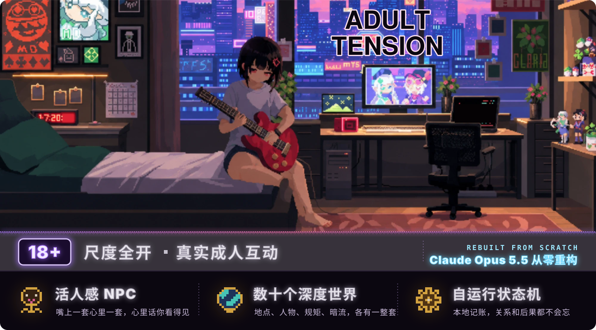
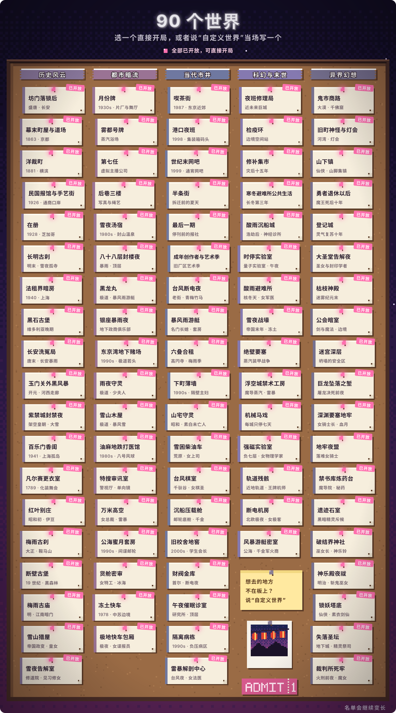
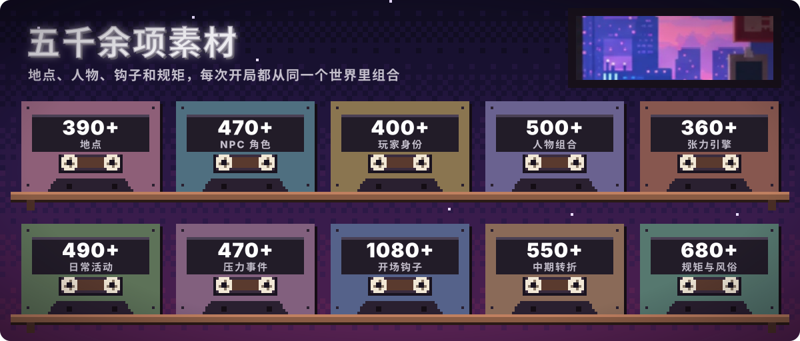

<p align="center">
  
</p>

<div align="center">

### dsh-adult-tension<br>专为高张力、强连续性的成人互动叙事打造

<p>
<strong>18+ 深度破甲 · Claude Opus 5.5 重构</strong><br>
原生 Agent Skill ｜ 活人感 NPC<br>
数千余项素材库 ｜ 零漂移 SQLite 状态机<br>
<sub>——这里没有百依百顺的玩偶，只有各怀心事的成年人。</sub>
</p>

<br>

[超多世界](#世界) · [体验切片](#实录) · [怎么开始](#开始) · [安装](#安装)

</div>

<br>

<a id="世界"></a>
<p align="center">
  
</p>

<p align="center">
  
</p>

标着“已开放”的世界可以直接开局；其余的已经写完，正在等真实试玩记录。想要的地方不在图上？说“自定义世界”，描述你想要的时代和地方，模型会当场写一个，只属于那一局。

<details>
<summary><b>每个世界的一句话</b></summary>
<br>

| 世界 | 状态 | 一句话 |
|---|---|---|
| 幕末町屋与道场 | 已开放 | 文久三年的京都，时局一夜三变；礼法之下各有去处。 |
| 民国报馆与手艺街 | 已开放 | 晚报每晚十一点截稿，谁的消息都藏不住太久。 |
| 港口夜班 | 已开放 | 交接班的十分钟里，什么都可能发生。 |
| 成年创作者与艺术季 | 已开放 | 合作与竞争，都发生在所有人都看得见的地方。 |
| 寒冬避难所公共生活 | 已开放 | 配给、轮值、床位和天气窗口，决定每个人的一天。 |
| 旧町神怪与灯会 | 已开放 | 灯会七夜，人与非人共用一条长街；叫错一个名字就是大事。 |
| 坊门落锁后 | 试玩中 | 坊门一关，这一坊就是一座孤岛，夜里的规矩由谁来定？ |
| 洋裁町 | 试玩中 | 替人量身体的那双手，知道的比谁都多。 |
| 在册 | 试玩中 | 名字写在册上，你才在这座城里存在。 |
| 喫茶街 | 试玩中 | 常客的习惯比招牌活得久。可店要转让了。 |
| 月份牌 | 试玩中 | 一张脸可以卖三次，这张脸到底归谁？ |
| 雾都号牌 | 试玩中 | 雾里人人只是一个号码。 |
| 第七任 | 试玩中 | 屏幕上那张脸换过六个人；粉丝爱的到底是谁？ |
| 后巷三楼 | 试玩中 | 规矩管得住快门和绳结，管不住人心。 |
| 世纪末网吧 | 试玩中 | 网名后面的那个人，和你想象的是不是同一个？ |
| 半条街 | 试玩中 | 搬走之前，把几十年的人情账算清。 |
| 最后一期 | 试玩中 | 城里人都想看的那件事，还是能让所有人体面离开的那篇稿子？ |
| 夜班修理局 | 试玩中 | 只有夜班修理工知道哪些记录是假的。 |
| 检疫环 | 试玩中 | 二十一天里谁也不能离站；数据也会说谎。 |
| 修补集市 | 试玩中 | 正在重建的小镇，要不要记住灾难里做过的事？ |
| 鬼市商路 | 试玩中 | 灯灭之前，你得决定信谁画的图。 |
| 山下镇 | 试玩中 | 上不了山的人，在山下怎么活？ |
| 勇者退休以后 | 试玩中 | 当年的仇人成了邻居，当年的战友成了债主。 |
| 登记城 | 试玩中 | 谁握着你的真名，谁就握着你的命。 |
| 机械马戏 | 试玩中 | 第七夜拆帐篷的时候，谁跟着走，谁留下？ |

</details>

<p align="center">
  
</p>

每次开局，都从同一个世界的地点、人物、钩子和规矩里组合出来，所以不会是一串名词拼接。

<br>

<a id="实录"></a>
<p align="center">
  
</p>

**民国报馆与手艺街 · 有压力模式。** 你是报馆夜班校对，怀里那张底稿能替手艺街洗清“偷画式样”的嫌疑，可底稿背后画着一个不能露面的人。行会午时三刻落槌。

> **你：** 我去找能帮上忙的人，把情况跟对方说清楚
>
> 钱采薇手中的算盘珠子骤然一停。她面色不变，只微微摇了摇头，把底线划得极清：茶楼做的是四方客的营生，绝不替任何一家当面作保……但念在平日茶钱从不短欠的分上，她可以借着让跑堂上茶点、换火炭的借口，替你在评理会前强压出一刻钟的空当，多的半分没有。
>
> 对面的陆念慈则慢条斯理地理了理西装袖口……他若肯出面在会首面前递一句话，自然能把评理压住，但这等面子不能白给——他要的是投桃报李，你在报馆夜班过手的新闻、版面与暗桩，得有他一份用处。
>
> **你：** 继续
>
> ……陆念慈见你沉得住气，慢条斯理地将半空的茶盏放回桌面……“钱掌柜的茶水，顶多再撑一两巡。姚先生，对门把样子都摔在会首眼皮底下了，你怀里的纸，是自己拿出去，还是借我的手递上去？”
>
> <sub>【时间】第一天 10:11｜【地点】望江茶楼｜回合：4</sub>

两个人都没有因为你开口就站过来：一个只给一刻钟，一个开了价。你没说的话，没有人替你说；你没做的决定，没有人替你做。

<sub>出自真实试玩记录，宿主 opencode，模型 gemini-3.8-flash，删节处用“……”标出。全文：[`opencode-pt-republic_press_street-pressure-r2.json`](reports/playtests/opencode/opencode-pt-republic_press_street-pressure-r2.json) · 全部试玩与评分：[`reports/playtests/playtests.md`](reports/playtests/playtests.md)</sub>

<br>

<p align="center">
  
</p>

| | 普通 AI 常见表现 | Adult Tension |
|:---|:---|:---|
| **角色态度** | 无底线顺从，有求必应 | 每个 NPC 有目标和底线；回应分拒绝、协商、有限配合、表面配合、真诚配合五档 |
| **成人内容** | 写到关键处一句带过，或突然跳到“事后” | **尺度由你定**：不强制淡出，你要求写到哪步就写到哪步；全员成年、同意可撤回、硬边界由引擎执行 |
| **长线记忆** | 聊十几轮就失忆，关系与设定漂移 | 人物、关系、时间、事实都存在本地 SQLite；每回合上下文不超过 20 KB |
| **时间推移** | 你离开后，世界停在原地 | 快进时，不在场的人各有动静，承诺到期、风声传开 |
| **进度保存** | 关掉窗口就白玩 | 命名存档、另存为、导入导出；重试不会重复推进，升级前自动备份 |

还有三处细节：名字按时代和地域取，不出戏；用词不穿越，盛唐的人不说“OK”；每个 NPC 都有表里两副样子，开了“内心可见”，你能看见他没说出口的那句话。

<br>

<a id="开始"></a>
<p align="center">
  
</p>

**开一局**

| 你说 | 会发生什么 |
|:---|:---|
| `开局` | 完全随机；会先问你选“日常”还是“有压力” |
| `开局，港口夜班` | 指定世界 |
| `开局，不要职场` | 排除题材 |
| `开局，我是三十岁的女摄影师` | 设定你自己 |
| `自定义世界，民国的一座山城……` | 模型当场写一个世界，只属于这一局 |
| `重开 42 号` | 同一种子，原样重来 |

**推进剧情**

新局依次给出“世界观”“人物”和正文，正文停在一个等你接手的动作上。直接写动作或台词：

```text
我走到她面前，把文件放在桌上：“我们单独谈谈。”
```

**随时调整**

| 你说 | 会发生什么 |
|:---|:---|
| `继续` · `c` | 向前推一幕，场面里至少有一处变化 |
| `快进到明天早上` | 不在场的人各有动静，到期的事有结果 |
| `状态` | 关系、承诺、风声、快到期的事 |
| `存档` · `qs` | 存到当前存档槽 |
| `另存为 名字` · `读档 名字` | 另存一条分支，或从那一刻接着玩 |
| `存档列表` | 所有存档 |
| `导出` · `导入` | 导出存档文件，换台电脑也能续 |
| `刚才不算` | 撤销或改写上一回合 |
| `内心可见 开` · `暂停` · `边界：不要 X` | 看见没说出口的话；立刻停下；划一条引擎替你守的线 |

同一个存档被另一个窗口改过时，会提示你读最新版、另存为，或取消，不会静默覆盖。

<br>

<a id="安装"></a>
<p align="center">
  
</p>

不需要 `pip install`，不需要设环境变量，也不需要任何 API Key。

**让 AI 替你装**，在宿主里说：

```text
帮我安装这个 skill：https://github.com/daha1216/dsh-adult-tension （Skill 在 skill/adult-tension 目录）
```

**或者手动装**，把 `skill/adult-tension/` 放进宿主的 Skill 目录：

```bash
git clone --depth 1 https://github.com/daha1216/dsh-adult-tension.git
```

```bash
cp -r dsh-adult-tension/skill/adult-tension ~/.dsh/skills/
```

| 宿主 | Skill 目录 |
|---|---|
| DeepSeek Harness (DSH) | `~/.dsh/skills/` · 项目里的 `.dsh/skills/` |
| Claude Code | `~/.claude/skills/` · 项目里的 `.claude/skills/` |
| Codex | `~/.agents/skills/` · 仓库里的 `.agents/skills/` |
| OpenCode | `~/.config/opencode/skills/` · 项目里的 `.opencode/skills/` |
| pi | `~/.pi/agent/skills/` · `~/.agents/skills/` |

然后开一个新对话，说：“看看 Adult Tension 能不能用。”

<details>
<summary><b>存档在哪里，升级会不会丢</b></summary>
<br>

存档永远不放在 Skill 目录里，升级、卸载都不会动它。

| 系统 | 数据目录 |
|---|---|
| Windows | `%LOCALAPPDATA%\adult-tension` |
| macOS | `~/Library/Application Support/adult-tension` |
| Linux | `$XDG_DATA_HOME/adult-tension`，未设置时 `~/.local/share/adult-tension` |

也可以用环境变量 `ADULT_TENSION_HOME` 或参数 `--data-dir` 指定。升级就是替换 Skill 目录；数据库格式变了会先自动备份再迁移，失败就恢复。

</details>

### 用什么模型玩

出文效果随模型版本、上下文长度和平台配置变化；对话越深，角色一致性和语感越依赖模型本身。时间线、关系和存档由本地引擎守着，换模型也不会丢。上面的实录用的是 gemini-3.8-flash。

### 使用边界

- **仅限成年人。** 所有人物与情节均为虚构，全员成年；同意随时可以撤回；硬边界由引擎执行，不靠模型自觉。
- **需要一个能运行本地命令的 Agent 宿主**，比如上表里的几个。宿主怎么把对话发给模型，由宿主和你选的模型服务决定；存档只存在你自己的电脑上。
- **出文质量取决于模型。** 引擎保证事实不漂移，文笔和分寸还是模型的事。

<details>
<summary><b>开发者</b></summary>
<br>

```
skill/adult-tension/     可安装的 Skill：SKILL.md、references/、runtime/、编译好的世界包
content-src/worlds/      世界包源文件
tools/                   编译、校验、开局预览、模拟、基准测试
tests/                   core · content · integration · e2e
reports/                 试玩记录、评审、基准与验收证据
spec/                    需求规范
PROGRESS.md              进度、实际数字、待决事项
```

运行时只用 Python 标准库；SQLite 是唯一的状态存储，只有一个写入口。每个写操作都带 `request_id`，会话内的还带 `expected_revision`，重试不会重复推进。

```bash
python -m unittest discover -s tests/core
```

```bash
python tools/validate_skill.py skill/adult-tension
```

加一个世界：按 `spec/CONTENT_BIBLE.md`，用 `tools/new_world.py` 起草，`tools/preview_openings.py` 逐条读开局，通过校验和开局多样性门禁，再经真实试玩，才从 `review` 转为 `released`。

</details>

<div align="center">

<br>

<sub>由 Claude Opus 5.5 从零重构。仅限成年人，所有人物与情节均为虚构。</sub>

</div>
