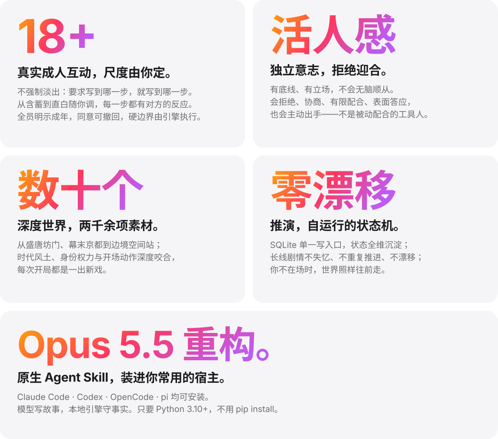
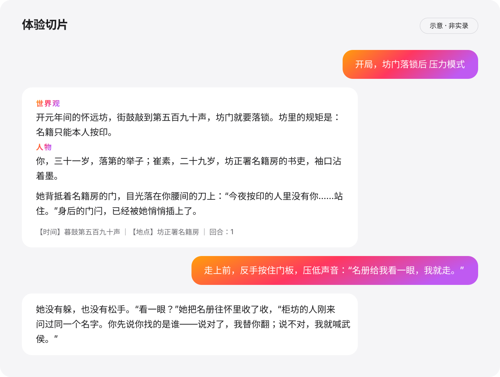
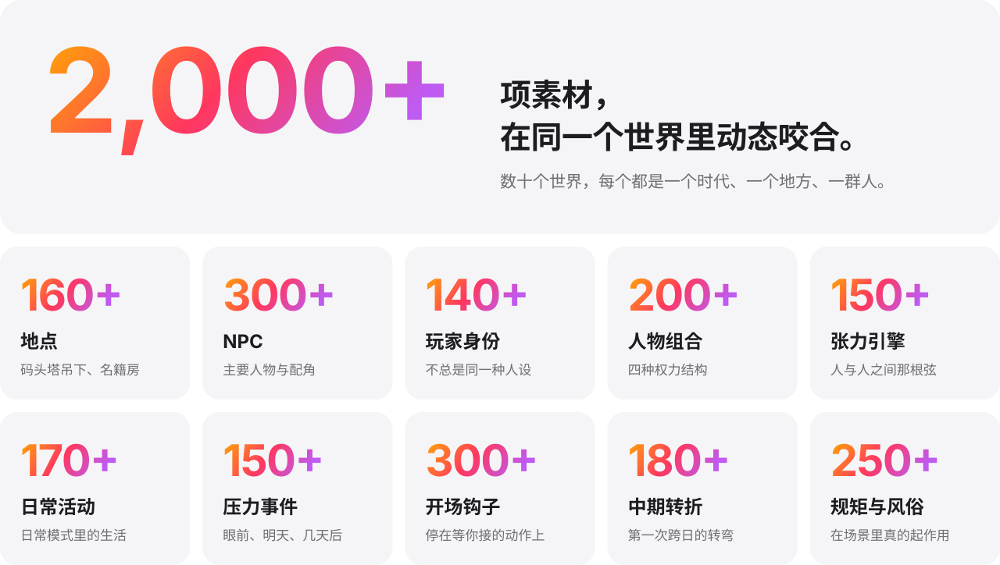
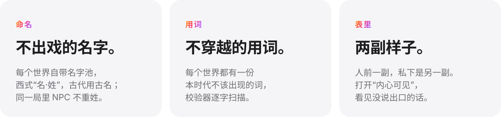

<picture>
  <source media="(prefers-color-scheme: dark)" srcset=".github/readme/hero-dark.svg">
  
</picture>

<div align="center">

<br>

[体验 ›](#一段开局)　　　[世界 ›](#数十个世界)　　　[怎么开始 ›](#怎么开始)　　　[安装 ›](#安装)

<br>
<br>

## 写给成年人。<br>也写给长线。

角色敢于直面激烈冲突、高张力的暧昧拉扯与深层的利益较量。<br>
模型写故事，本地引擎守事实——聊到第几百轮，人还是那个人。

<br>

</div>

<picture>
  <source media="(prefers-color-scheme: dark)" srcset=".github/readme/features-dark.svg">
  
</picture>

<div align="center">

<br>
<br>

## 一段开局。

她不会因为你开口就把名册交出来。<br>
她会先问你要什么，再决定给不给。

<br>

</div>

<picture>
  <source media="(prefers-color-scheme: dark)" srcset=".github/readme/demo-dark.svg">
  
</picture>

<div align="center">

<br>
<br>

## 数十个世界。

每次开局都不是名词拼接，而是时代风土、身份权力、<br>
人际暗涌与开场动作的深度咬合。开局的一切，只在同一个世界里发生。

<br>

</div>

<picture>
  <source media="(prefers-color-scheme: dark)" srcset=".github/readme/worlds-dark.svg">
  
</picture>

<br>

<details>
<summary><b>每个世界的一句话</b></summary>
<br>

| 世界 | 一句话 |
|---|---|
| 坊门落锁后 | 坊门一关，这一坊就是一座孤岛，夜里的规矩由谁来定？ |
| 幕末町屋与道场 | 文久三年的京都，时局一夜三变；礼法之下各有去处。 |
| 洋裁町 | 替人量身体的那双手，知道的比谁都多。 |
| 民国报馆与手艺街 | 晚报每晚十一点截稿，谁的消息都藏不住太久。 |
| 在册 | 名字写在册上，你才在这座城里存在。 |
| 喫茶街 | 常客的习惯比招牌活得久。可店要转让了。 |
| 月份牌 | 一张脸可以卖三次，这张脸到底归谁？ |
| 雾都号牌 | 雾里人人只是一个号码。 |
| 第七任 | 屏幕上那张脸换过六个人；粉丝爱的到底是谁？ |
| 后巷三楼 | 规矩管得住快门和绳结，管不住人心。 |
| 港口夜班 | 交接班的十分钟里，什么都可能发生。 |
| 世纪末网吧 | 网名后面的那个人，和你想象的是不是同一个？ |
| 半条街 | 搬走之前，把几十年的人情账算清。 |
| 最后一期 | 城里人都想看的那件事，还是能让所有人体面离开的那篇稿子？ |
| 成年创作者与艺术季 | 合作与竞争，都发生在所有人都看得见的地方。 |
| 夜班修理局 | 只有夜班修理工知道哪些记录是假的。 |
| 检疫环 | 二十一天里谁也不能离站；数据也会说谎。 |
| 修补集市 | 正在重建的小镇，要不要记住灾难里做过的事？ |
| 寒冬避难所公共生活 | 配给、轮值、床位和天气窗口，决定每个人的一天。 |
| 鬼市商路 | 灯灭之前，你得决定信谁画的图。 |
| 旧町神怪与灯会 | 灯会七夜，人与非人共用一条长街；叫错一个名字就是大事。 |
| 山下镇 | 上不了山的人，在山下怎么活？ |
| 勇者退休以后 | 当年的仇人成了邻居，当年的战友成了债主。 |
| 登记城 | 谁握着你的真名，谁就握着你的命。 |
| 机械马戏 | 第七夜拆帐篷的时候，谁跟着走，谁留下？ |

标着“已发布”的世界参与随机开局；其余的内容已经写完，正在等真实试玩记录。<br>
想要的时代不在里面？说“自定义世界”，描述你想要的地方，模型会当场写一个，只属于那一局。

</details>

<br>

<picture>
  <source media="(prefers-color-scheme: dark)" srcset=".github/readme/numbers-dark.svg">
  
</picture>

<br>

<picture>
  <source media="(prefers-color-scheme: dark)" srcset=".github/readme/details-dark.svg">
  
</picture>

<div align="center">

<br>
<br>

## 多轮长线，<br>为什么不会崩盘。

<br>

</div>

| | 普通 AI 常见表现 | adult-tension |
|:---|:---|:---|
| **角色态度** | 无底线顺从，有求必应，沦为工具人 | **真·活人感**：每个 NPC 有目标和底线；回应分拒绝、协商、有限配合、表面配合、真诚配合五档 |
| **成人内容** | 写到关键处一句带过，或突然跳到“事后” | **尺度由你定**：不强制淡出，要求写到哪步就写到哪步；全员成年、同意可撤回、硬边界由引擎执行 |
| **长线记忆** | 聊十几轮就失忆，关系与设定漂移 | **SQLite 状态机**：人物、关系、时间、事实都由本地引擎记录；每回合上下文不超过 20 KB |
| **时间推移** | 玩家离开后世界停滞 | **离屏推演**：快进时，不在场的人各有动静，承诺到期、风声传开 |
| **进度保存** | 关掉窗口就白玩 | **原子级存档**：命名存档、另存为、导入导出；重试不重复推进，升级自动备份迁移 |

<div align="center">

<br>
<br>

## 怎么开始。

不用记语法。像跟真人编剧沟通一样，直接说大白话。

<br>

</div>

**开一局**

| 你说 | 会发生什么 |
|:---|:---|
| `开局` | 完全随机；会先问你选“日常”还是“有压力” |
| `开局，坊门落锁后` | 指定世界 |
| `开局，不要职场` | 排除题材 |
| `开局，我是三十岁的女摄影师` | 设定你自己 |
| `自定义世界，民国的一座山城……` | 模型当场写一个世界，只属于这一局 |
| `重开 42 号` | 同一种子，原样重来 |

**推进剧情**

新局依次给出“世界观”“人物”和正文，正文停在一个等你接手的动作上。直接写动作或台词：

```text
我走到她面前，把文件放在桌上：“我们单独谈谈。”
```

**随时调整**

| 你说 | 会发生什么 |
|:---|:---|
| `继续` · `c` | 向前推一幕，场面里至少有一处变化 |
| `快进到明天早上` | 不在场的人各有动静，到期的事有结果 |
| `状态` | 关系、承诺、风声、快到期的事 |
| `存档` · `qs` | 存到当前存档槽 |
| `另存为 名字` · `读档 名字` | 另存一条分支，或从那一刻接着玩 |
| `存档列表` | 所有存档 |
| `导出` · `导入` | 导出存档文件，换台电脑也能续 |
| `刚才不算` | 撤销或改写上一回合 |
| `内心可见 开` · `暂停` · `边界：不要 X` | 看见没说出口的话；立刻停下；划一条引擎替你守的线 |

同一个存档被另一个窗口改过时，会提示你读最新版、另存为，或取消，不会静默覆盖。

<div align="center">

<br>
<br>

## 安装。

只要 Python 3.10 或更高。不需要 `pip install`，不需要设环境变量。

<br>

</div>

**让 AI 替你装**，在宿主里说：

```text
帮我安装这个 skill：https://github.com/daha1216/dsh-adult-tension （Skill 在 skill/adult-tension 目录）
```

**或者手动装**，把 `skill/adult-tension/` 放进宿主的 Skill 目录：

```bash
git clone --depth 1 https://github.com/daha1216/dsh-adult-tension.git
```

```bash
cp -r dsh-adult-tension/skill/adult-tension ~/.claude/skills/
```

| 宿主 | Skill 目录 |
|---|---|
| Claude Code | `~/.claude/skills/` · 项目里的 `.claude/skills/` |
| Codex | `~/.agents/skills/` · 仓库里的 `.agents/skills/` |
| OpenCode | `~/.config/opencode/skills/` · 项目里的 `.opencode/skills/` |
| pi | `~/.pi/agent/skills/` · `~/.agents/skills/` |

然后开一个新对话，说：“看看 Adult Tension 能不能用。”

<details>
<summary><b>存档在哪里，升级会不会丢</b></summary>
<br>

存档永远不放在 Skill 目录里，升级、卸载都不会动它。

| 系统 | 数据目录 |
|---|---|
| Windows | `%LOCALAPPDATA%\adult-tension` |
| macOS | `~/Library/Application Support/adult-tension` |
| Linux | `$XDG_DATA_HOME/adult-tension`，未设置时 `~/.local/share/adult-tension` |

也可以用环境变量 `ADULT_TENSION_HOME` 或参数 `--data-dir` 指定。升级就是替换 Skill 目录；数据库格式变了会先自动备份再迁移，失败就恢复。

</details>

<div align="center">

<br>
<br>

## 用什么模型玩。

出文效果会随模型版本、上下文长度和平台配置变化；<br>
对话越深，角色一致性和语感越依赖模型本身。<br>
时间线、关系和存档由本地引擎守着，换模型也不会丢。

<br>

</div>

<details>
<summary><b>开发者</b></summary>
<br>

```
skill/adult-tension/     可安装的 Skill：SKILL.md、references/、runtime/、编译好的世界包
content-src/worlds/      世界包源文件
tools/                   编译、校验、开局预览、模拟、基准测试
tests/                   core · content · integration · e2e
spec/                    需求规范
PROGRESS.md              进度、实际数字、待决事项
```

运行时只用 Python 标准库；SQLite 是唯一的状态存储，只有一个写入口。每个写操作都带 `request_id`，会话内的还带 `expected_revision`，重试不会重复推进。

```bash
python -m unittest discover -s tests/core
```

```bash
python tools/validate_skill.py skill/adult-tension
```

加一个世界：按 `spec/CONTENT_BIBLE.md`，用 `tools/new_world.py` 起草，`tools/preview_openings.py` 逐条读开局，通过校验和开局多样性门禁，再经真实试玩，才从 `review` 转为 `released`。

</details>

<div align="center">

<br>

<sub>由 Claude Opus 5.5 从零重构。仅限成年人，所有人物与情节均为虚构。</sub>

</div>
