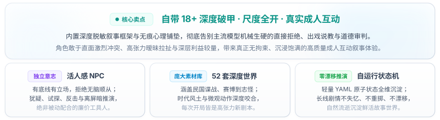
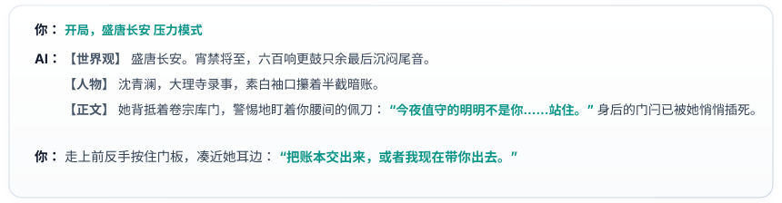

<div align="center">

<!-- 顶部极简语言切换（精细微灰 Segmented 按钮质感） -->
<p align="right" style="max-width: 860px; margin: 12px auto 6px auto; font-family: -apple-system, BlinkMacSystemFont, 'SF Pro Text', 'Segoe UI', 'PingFang SC', sans-serif; font-size: 12.5px;">
  <span style="background: #f1f5f9; border: 1px solid #e2e8f0; border-radius: 12px; padding: 4px 10px; display: inline-block;">
    <a href="./README.md" style="font-weight: 600; color: #0284c7; text-decoration: none;">简体中文</a>
    <span style="color: #cbd5e1; margin: 0 4px;">|</span>
    <a href="./README.en.md" style="font-weight: 400; color: #64748b; text-decoration: none;">English</a>
  </span>
</p>

<!-- 独立超开阔项目大标题与核心金句 -->


<!-- 4 大特性胶囊微展条 -->


<!-- 4 大核心特性展板（纯白瓷质 · 55% 冰川透蓝环境光） -->


<p align="center" style="margin: 20px auto 16px auto;"></p>

<!-- 极简低调微注脚 -->


</div>

<br/>




---


每次开局都不是干瘪的名词拼接，而是时代风土、身份权力、人际暗涌与微观动作的深度咬合。系统内置 **` 52 套 ` 跨时代独立世界框架** 与上千项微观素材，涵盖从历史正剧、都市暗潮到异界幻想的丰富舞台：


<details>
<summary><b>📜 展开浏览：52 套世界框架完整名录（支持复制世界名直接开局）</b></summary>
<br/>

#### 🍸 都市暗流与高张力（12 套）
`舞厅大班与乐台后台` · `片场棚与月份牌画室` · `征信所与保人堂` · `老澡堂与打烊后的钟点` · `恋爱禁令与歌友会` · `蒸汽浴场与更衣号房` · `会员册与那道墨线` · `打赏榜与最后一格` · `动捕棚与中之人` · `课时铃的两端` · `量体尺与尺寸档案` · `私房写真与底片归属`

#### 🏛️ 历史正剧与风云（11 套）
`长安夜市与坊志` · `幕末町屋与道场` · `禁酒期爵士与报纸` · `雾都钟表与港务街` · `明治洋裁与译书町` · `民国报馆与手艺街` · `王朝百业与书院` · `昭和街角喫茶巡礼` · `湘西山路与乡志` · `风沙驿站与旧图` · `后方邮路与灯火`

#### ⚡ 近未来与边缘科幻（8 套）
`赛博街区与公共终端` · `星海边境生活站` · `废土驿站与修补集市` · `寒冬避难所公共生活` · `检疫站旁的生活区` · `地下管廊与城市修理局` · `灵气复苏十年后` · `废墟复兴小镇`

#### 🏮 异界契约与幻想（9 套）
`仙门藏书与驿镖` · `契约城与非人街坊` · `旧町神怪与灯会` · `地下城安全层营地` · `王都工坊与委托街` · `蜃景商路与鬼市` · `流动马戏与机械舞台` · `仙门山下百业镇` · `退休勇者之城`

#### 🎙️ 当代行业与市井（12 套）
`传媒编辑室与公开记录` · `同人街区与录音协作` · `成年创作者与校园艺术季` · `夜校学分与开放实验室` · `街角共同生活圈` · `磁带与夜市街区` · `千禧网络街坊` · `海岸渡船与观测旅行` · `地方行业与公共记忆` · `城市休闲与共享会客` · `远途休假与小镇停留` · `河岸康复与互助居所`

---

> 💡 **怎么开局**：看到心仪的世界？直接发一句：**「开局，舞厅大班与乐台后台 压力模式」** 或 **「开局，赛博街区」**，AI 会自动加载对应风土与专属人物关系。
</details>

---

### 🧩 为什么每次开局都不重复？

> 📊 **底层素材体量**：**52** 套世界框架 ｜ **128** 个互动地点 ｜ **89** 种 NPC 身份 ｜ **85** 条角色处境 ｜ **113** 种微观动作……上千项多维数据动态咬合，排列组合达天文级别。

当这套庞大的素材库运转时，世界框架决定风土，人物反差注入戏剧性，压力来源倒逼抉择，而细腻的动作库则保证了关系推进真实可信：

| 内容 | 数量 | 示例 |
| --- | --- | --- |
| 时代与地点 | 时代 31 · 地点 128 | 盛唐长安百鬼夜行、一九二八芝加哥禁酒期、文久幕末京都风云 |
| 张力引擎 | 72 条 | 天枢锁妖大阵灵气逆流、黑帮教父暗账审计之夜、时限逼近 |
| 压力来源 | 74 条 | 宵禁六百响更鼓将毕、同人展压盘死线近在眼前、经纪人在录音室门外敲门查岗 |
| 角色身份 | NPC 17 族 89 身份 · 玩家化身 33 种 | 权力与治理、家族与继承、服务与手艺 |
| 角色处境 | 85 条 | 秘密将破、旧事上门、洗刀水色变红的瞬间、录音红灯亮起时的实景耳语夜 |
| 人物性格与反差 | 反差轴 26 种 | 外冷内热、端庄放浪、禁欲破戒、严苛沦陷 |
| 关系与权力 | 4 种 | 玩家上位、NPC 上位、平等或动态切换 |
| 语言风格 | 表层风味 120 · 口癖语感 48 | 敬语过剩、句尾口癖、拟声词多 |
| 场景动作 | 交易摊牌 22 · 非交易靠近 91 | 核对一条时间线、让对方决定是否查看文件、在防喷罩前替她理顺耳机线 |
| 中期转折池 | 7 类 × 9~12（共 70 条） | 信息类、资源类、时限类等 |
| 配角功能 | 15 类 | 盟友、竞争者、误导者、催化剂 |

**更有质感的微观细节保障**：
* 🏷️ **拒绝出戏的命名**：内置专属名池（汉化、古代名、时代名），命名服从时代文化背景，不局限现代姓名。
* 💬 **立体的对话质感**：26 种称谓体系、47 种美学基调与 48 组语感口癖，写实基调下自动收口外观与口癖。
* 🎭 **微观肢体与动作画像**：涵盖地点画像、动作分类、身份行为与转折画像，赋予角色自然的肢体语言。想要扩充自定义内容？详见 [`references/加内容.md`](./references/加内容.md)。

---

## ✨ 核心能力

为什么多轮长线互动不会“崩盘”？本系统与普通 AI 角色扮演的核心差异：

| 游玩痛点 | 普通 AI 常见表现 | adult-tension 的解决方式 |
| :--- | :--- | :--- |
| **角色态度** | 无底线顺从，有求必应，沦为机械工具人 | **真·活人感**：拥有独立利益与底线，会试探、抗拒、主动行动 |
| **剧情尺度** | 稍有冲突或暧昧即道德说教、扫兴拒答 | **自带 18+ 破甲**：深度语境脱敏，尺度全放开，文字考究不露骨 |
| **长线记忆** | 聊上十几轮就失忆，关系与设定频繁漂移 | **全维 YAML 追踪**：状态与事件结构化沉淀，记忆不丢、人设不塌 |
| **时间推移** | 玩家离开后世界停滞，缺乏真实生机 | **离屏推演机制**：时间流逝时自动演算场景外事件与配角动态 |
| **进度保存** | 关掉窗口就白玩，无法分支出不同路线 | **原子级存档**：随时保存命名分支，像单机大作一样从原节点继续 |

---

## ▶️ 怎么开始

无需记忆复杂的固定语法，像跟真人编剧沟通一样，直接用日常大白话交流即可。

#### 1️⃣ 开启新故事

你想怎么开局，直接对 AI 表达意图：

* **完全随机**：发 `开局`（系统会询问选择紧迫刺激的「压力模式」，还是生活流的「日常模式」）。
* **指定题材**：`开局，想玩盛唐长安，大理寺暗查案卷的故事`
* **锁定困境**：`开局，旧事上门，其他随机`
* **严选官方**：`开局，只选自带世界`（仅从系统内置的 52 个世界框架中抽取）
* **自拟世界**：`开局，自拟全新世界`（突破预设库，由 AI 自由发挥创作）
* **精准复刻**：`开局，重开 42 号`（固定编号百分之百还原该局配置）

#### 2️⃣ 推进剧情

新局生成时依次包含 `世界观`、`人物`、`正文` 三个部分（前两项各 1-2 句交代背景，仅新局呈现，载入与续玩不重复三个标题）。正文会自然停在等你行动的接手点。

**无需特定格式**，直接输入你的动作或台词即可：

```text
我走到她面前，把文件放在桌上，对她说：“我们单独谈谈。”
跟着她钻进电梯，问今晚去哪。
```

#### 3️⃣ 随时调整与管理

| 意图 | 随口怎么说 | 效果说明 |
| :--- | :--- | :--- |
| **往前推** | `继续`（或 `c`） | 停顿处向前推一个节拍 |
| **跳时间** | `快进到明天早上` | 跳过空白时间，场景外的离屏事件自动推演 |
| **看局面** | `状态` | 查看所在地点、在场角色、当前压力与接续动作 |
| **快速存** | `存档`（或 `qs`） | 快速写入当前存档槽，单行回执不刷屏 |
| **多分支** | `保存 名字` / `载入 名字` | 另存为独立分支，或从原节点继续 |
| **看进度** | `列出存档` | 显示所有命名存档的名称、回合与处境摘要 |
| **带备份** | `导出存档` / `载入存档` | 导出 YAML 文本备份，发回即可原地续玩 |
| **小后悔** | `撤销刚才的 X` | 只撤销最近一个事件，不推进回合 |

> 💡 更多高级功能（贴视角、语态切换、冻结推演等）随用随说，详见 [`commands.yaml`](./commands.yaml)。一个会话默认使用自己的专属存档；保存时若存档已被其他窗口修改，会提示你读取最新版本、另存为其他名称或取消，不会静默覆盖。

---

## 🚀 快速安装

让 AI 直接安装本仓库：

```text
帮我安装这个 skill：https://github.com/daha1216/dsh-adult-tension
```

也可以手动安装：把仓库根目录的一整套文件（含 `SKILL.md`、`commands.yaml`、`references/`、`scripts/data/`、`authoring/`、`maintenance/`、`saves/`、`tests/`、`agents/` 与依赖清单）完整复制到 DeepSeek Harness 的技能目录。不要只复制 `SKILL.md`；维护清单与审查文件也有实际消费者。

复制完成后，让 AI 加载 `adult-tension` 技能即可开始。

---

## 🧠 用什么模型玩

具体游玩体验和出文效果，会随模型版本、上下文长度和平台配置而变化。以下是维护者在体验中的参考建议：

* **DeepSeek**：长线中文叙事底蕴深厚，人物心理状态连续性极佳，适合历史权谋与多轮慢热游玩。
* **Grok**：临场感强，语言风格更放开，在紧张对峙与快节奏情节推进中表现突出。

其他主流模型也能正常游玩；对话轮次越深，角色一致性、时间线和语感就越依赖所选模型的上下文能力。建议按你的平台与偏好实际试用。

---

## 🛠️ 辅助工具与底层架构

<details>
<summary><b>📜 展开浏览：52 套世界框架完整名录（支持复制世界名直接开局）</b></summary>
<br/>

#### 🍸 都市暗流与高张力（12 套）
`舞厅大班与乐台后台` · `片场棚与月份牌画室` · `征信所与保人堂` · `老澡堂与打烊后的钟点` · `恋爱禁令与歌友会` · `蒸汽浴场与更衣号房` · `会员册与那道墨线` · `打赏榜与最后一格` · `动捕棚与中之人` · `课时铃的两端` · `量体尺与尺寸档案` · `私房写真与底片归属`

#### 🏛️ 历史正剧与风云（11 套）
`长安夜市与坊志` · `幕末町屋与道场` · `禁酒期爵士与报纸` · `雾都钟表与港务街` · `明治洋裁与译书町` · `民国报馆与手艺街` · `王朝百业与书院` · `昭和街角喫茶巡礼` · `湘西山路与乡志` · `风沙驿站与旧图` · `后方邮路与灯火`

#### ⚡ 近未来与边缘科幻（8 套）
`赛博街区与公共终端` · `星海边境生活站` · `废土驿站与修补集市` · `寒冬避难所公共生活` · `检疫站旁的生活区` · `地下管廊与城市修理局` · `灵气复苏十年后` · `废墟复兴小镇`

#### 🏮 异界契约与幻想（9 套）
`仙门藏书与驿镖` · `契约城与非人街坊` · `旧町神怪与灯会` · `地下城安全层营地` · `王都工坊与委托街` · `蜃景商路与鬼市` · `流动马戏与机械舞台` · `仙门山下百业镇` · `退休勇者之城`

#### 🎙️ 当代行业与市井（12 套）
`传媒编辑室与公开记录` · `同人街区与录音协作` · `成年创作者与校园艺术季` · `夜校学分与开放实验室` · `街角共同生活圈` · `磁带与夜市街区` · `千禧网络街坊` · `海岸渡船与观测旅行` · `地方行业与公共记忆` · `城市休闲与共享会客` · `远途休假与小镇停留` · `河岸康复与互助居所`

---

> 💡 **怎么开局**：看到心仪的世界？直接发一句：**「开局，舞厅大班与乐台后台 压力模式」** 或 **「开局，赛博街区」**，AI 会自动加载对应风土与专属人物关系。
</details>

---

## 📄 许可

本仓库按内容类型采用双许可（详见 [LICENSE](./LICENSE)）：

- **代码与工程配置**（`scripts/*.py`、`tests/`、`.github/`、`pytest.ini`、依赖清单）：[MIT License](./LICENSE)
- **叙事素材与文档**（世界框架、素材池、文案模板、审查记录及各文档）：[CC BY-NC 4.0](https://creativecommons.org/licenses/by-nc/4.0/deed.zh)——可自由使用与改编（需署名），不得商用

本项目仅面向虚构成年人互动叙事（18+）；许可条款不替代 README 中的合规声明。


