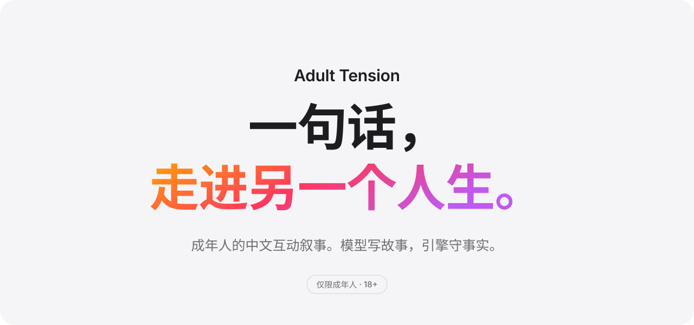
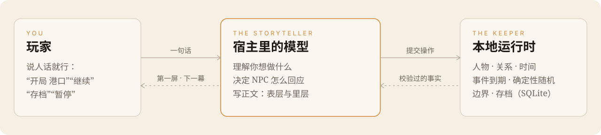
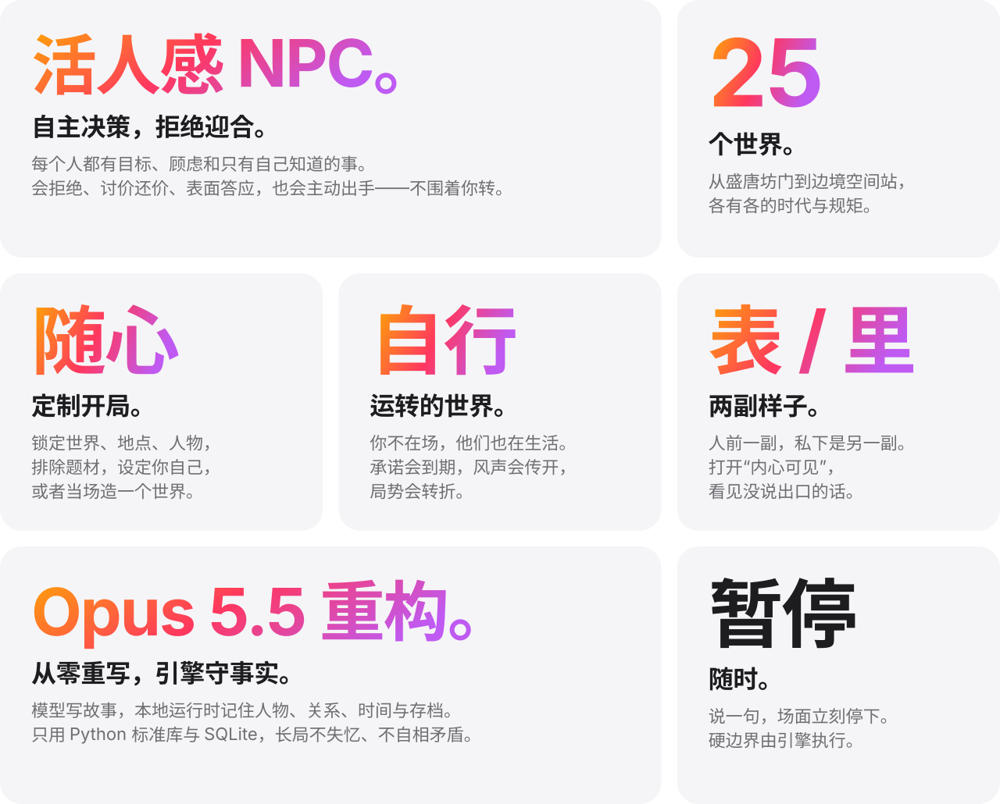
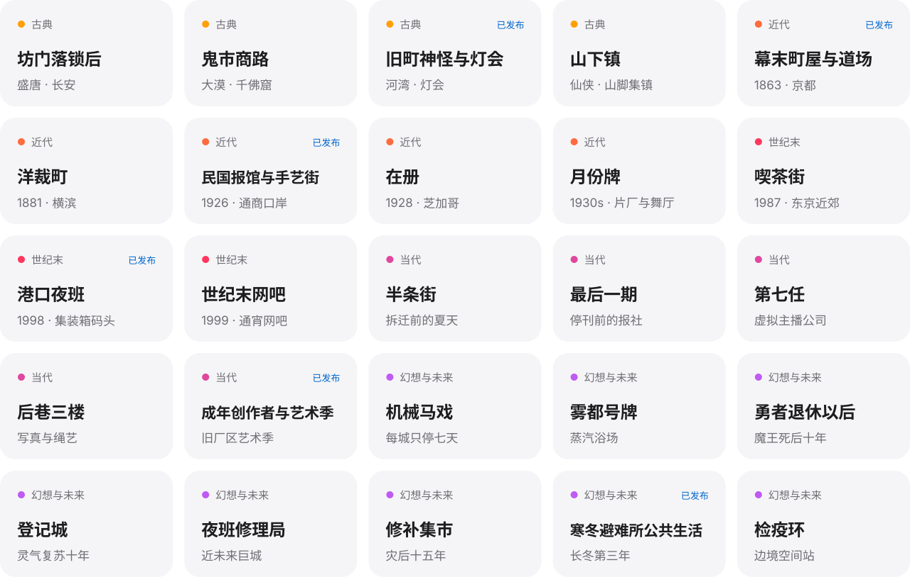

<picture>
  <source media="(prefers-color-scheme: dark)" srcset=".github/readme/hero-dark.svg">
  
</picture>

<div align="center">

<br>

[安装 ›](#安装)　　　[二十五个世界 ›](#二十五个世界)　　　[怎么玩 ›](#怎么玩)

<br>
<br>

## 模型写故事。引擎守事实。

在 Claude Code、Codex、OpenCode 里说一句“开局”。<br>
宿主里的模型理解你、替每个人做决定、写出下一幕；<br>
随 Skill 附带的本地运行时，记住所有不该被忘掉的事。

<br>

</div>

<picture>
  <source media="(prefers-color-scheme: dark)" srcset=".github/readme/flow-dark.svg">
  
</picture>

<div align="center">

<br>
<br>

## 不只是聊天。<br>是一个会自己运转的世界。

NPC 有目标、顾虑和只有自己知道的事，会拒绝，也会主动出手。<br>
你不在场的时候，他们也在生活；承诺会到期，风声会传开。

<br>

</div>

<picture>
  <source media="(prefers-color-scheme: dark)" srcset=".github/readme/bento-dark.svg">
  
</picture>

<div align="center">

<br>
<br>

## 二十五个世界。

一个世界，是一个时代、一个地方、一群人。<br>
开局的一切都只在同一个世界里发生。

<br>

</div>

<picture>
  <source media="(prefers-color-scheme: dark)" srcset=".github/readme/worlds-dark.svg">
  
</picture>

<br>

<details>
<summary><b>每个世界的一句话</b></summary>
<br>

| 世界 | 一句话 |
|---|---|
| 坊门落锁后 | 坊门一关，这一坊就是一座孤岛，夜里的规矩由谁来定？ |
| 鬼市商路 | 灯灭之前，你得决定信谁画的图。 |
| 旧町神怪与灯会 | 灯会七夜，人与非人共用一条长街；叫错一个名字就是大事。 |
| 山下镇 | 上不了山的人，在山下怎么活？ |
| 幕末町屋与道场 | 文久三年的京都，时局一夜三变；礼法之下各有去处。 |
| 洋裁町 | 替人量身体的那双手，知道的比谁都多。 |
| 民国报馆与手艺街 | 晚报每晚十一点截稿，谁的消息都藏不住太久。 |
| 在册 | 名字写在册上，你才在这座城里存在。 |
| 月份牌 | 一张脸可以卖三次，这张脸到底归谁？ |
| 喫茶街 | 常客的习惯比招牌活得久。可店要转让了。 |
| 港口夜班 | 交接班的十分钟里，什么都可能发生。 |
| 世纪末网吧 | 网名后面的那个人，和你想象的是不是同一个？ |
| 半条街 | 搬走之前，把几十年的人情账算清。 |
| 最后一期 | 城里人都想看的那件事，还是能让所有人体面离开的那篇稿子？ |
| 第七任 | 屏幕上那张脸换过六个人；粉丝爱的到底是谁？ |
| 后巷三楼 | 规矩管得住快门和绳结，管不住人心。 |
| 成年创作者与艺术季 | 合作与竞争，都发生在所有人都看得见的地方。 |
| 机械马戏 | 第七夜拆帐篷的时候，谁跟着走，谁留下？ |
| 雾都号牌 | 雾里人人只是一个号码。 |
| 勇者退休以后 | 当年的仇人成了邻居，当年的战友成了债主。 |
| 登记城 | 谁握着你的真名，谁就握着你的命。 |
| 夜班修理局 | 只有夜班修理工知道哪些记录是假的。 |
| 修补集市 | 正在重建的小镇，要不要记住灾难里做过的事？ |
| 寒冬避难所公共生活 | 配给、轮值、床位和天气窗口，决定每个人的一天。 |
| 检疫环 | 二十一天里谁也不能离站；数据也会说谎。 |

标着“已发布”的六个世界参与随机开局；其余十九个内容已经写完，正在等真实试玩记录。<br>
想要的时代不在里面？说“自定义世界”，描述你想要的地方，模型会当场写一个，只属于那一局。

</details>

<div align="center">

<br>
<br>

## 安装。

只要 Python 3.10 或更高。不需要 `pip install`，不需要设环境变量。<br>
把 `skill/adult-tension/` 放进宿主的 Skill 目录，就装好了。

<br>

</div>

```bash
git clone --depth 1 https://github.com/daha1216/dsh-adult-tension.git
```

```bash
cp -r dsh-adult-tension/skill/adult-tension ~/.claude/skills/
```

| 宿主 | Skill 目录 |
|---|---|
| Claude Code | `~/.claude/skills/` · 项目里的 `.claude/skills/` |
| Codex | `~/.agents/skills/` · 仓库里的 `.agents/skills/` |
| OpenCode | `~/.config/opencode/skills/` · 项目里的 `.opencode/skills/` |
| pi | `~/.pi/agent/skills/` · `~/.agents/skills/` |

然后开一个新对话，说：“看看 Adult Tension 能不能用。”

<details>
<summary><b>存档在哪里，升级会不会丢</b></summary>
<br>

存档永远不放在 Skill 目录里，升级、卸载都不会动它。

| 系统 | 数据目录 |
|---|---|
| Windows | `%LOCALAPPDATA%\adult-tension` |
| macOS | `~/Library/Application Support/adult-tension` |
| Linux | `$XDG_DATA_HOME/adult-tension`，未设置时 `~/.local/share/adult-tension` |

也可以用环境变量 `ADULT_TENSION_HOME` 或参数 `--data-dir` 指定。升级就是替换 Skill 目录；数据库格式变了会先自动备份再迁移，失败就恢复。

</details>

<div align="center">

<br>
<br>

## 怎么玩。

直接说话。下面这些，它都听得懂。

<br>

</div>

| 你说 | 会发生什么 |
|---|---|
| `开局` · `开局 压力` · `开局 港口` · `重开 12 号` | 开一局。没说模式，会先问你“日常还是有压力” |
| `不要职场` · `女性 NPC 为主` · `我是三十岁的摄影师` | 排除题材、指定偏好、设定你自己 |
| 任何行动或对白 · `继续` | 推进一幕 |
| `快进到晚上` · `来点转折` | 时间往前走，不在场的人也各有动静 |
| `内心可见 开` · `语态 某人 里` | 看见没说出口的话 |
| `存档` · `读档` · `继续上次` | 隔天回来，接着玩 |
| `状态` | 关系、承诺、风声、快到期的事 |
| `刚才不算` | 撤销或改写上一幕 |

<div align="center">

<br>
<br>

## 边界，由引擎守着。

**全员成年。** 每个角色都是明示的成年人，校验器拦下任何未成年暗示。<br>
**硬边界。** 说“边界：不要 X”，越界的内容会被引擎直接拒绝，不靠模型自觉。<br>
**随时暂停。** 说“暂停”，场面立刻停下；同意随时可以撤回。

<br>
<br>

</div>

<details>
<summary><b>开发者</b></summary>
<br>

```
skill/adult-tension/     可安装的 Skill：SKILL.md、references/、runtime/、编译好的世界包
content-src/worlds/      世界包源文件
tools/                   编译、校验、开局预览、模拟、基准测试
tests/                   core · content · integration · e2e
spec/                    需求规范
PROGRESS.md              进度、实际数字、待决事项
```

运行时只用 Python 标准库；SQLite 是唯一的状态存储，只有一个写入口。每个写操作都带 `request_id`，会话内的还带 `expected_revision`，重试不会重复推进。

```bash
python -m unittest discover -s tests/core
```

```bash
python tools/validate_skill.py skill/adult-tension
```

加一个世界：按 `spec/CONTENT_BIBLE.md`，用 `tools/new_world.py` 起草，`tools/preview_openings.py` 逐条读开局，通过校验和开局多样性门禁，再经真实试玩，才从 `review` 转为 `released`。

</details>

<div align="center">

<br>

<sub>仅限成年人。所有人物与情节均为虚构。</sub>

</div>
